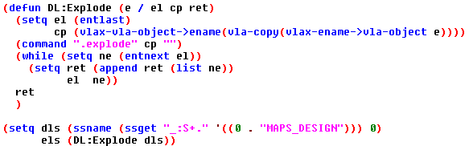
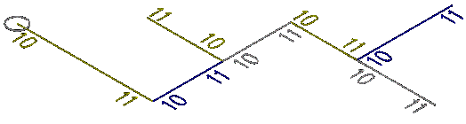
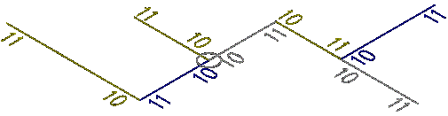
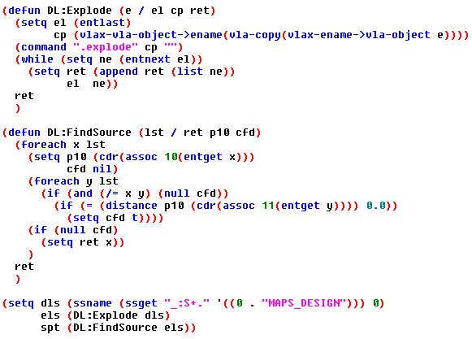
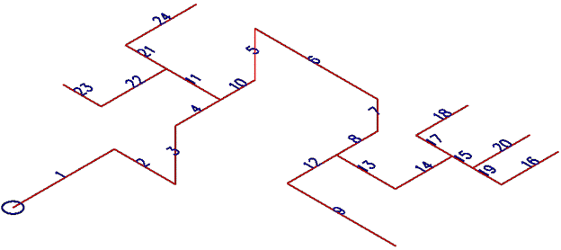

If you have ever been given a Revit model and tried to get a leg up on your job using ProcessRun, then you have known true frustration. It isn't perfect, but it is a truly epic tool that can directly affect the profitability of a project these days. I recently received a Revit model for a biopharmaceutical project and I honestly don't even know how they managed to get so many things slightly out of skew. We found that it was producing a DesignLine object for us, but the majority simply wouldn't fill due to a poor quality of design in Revit. Even the portions that did fill were not what I would consider it a valid starting point for designers.

I had been listening to the outcry of detailers for a few days and finally got around to looking into why they were losing their minds. I get it now, but what can we actually do with a DesignLine object? It has absolutely no useful VLA exposures, no Scripting context or even any .Net API methods. It seems like all you can do is throw your hands in the air and painstakingly grip edit it into conformity. However, this problem led me to a fascinating and purely coincidental discovery that I will make an attempt illustrate.

If you are looking for a quick solution to a similar problem, you won't find it here, but if you are looking for a guided path towards creating your own solution, then keep reading. I will cover all the important things I learned, enough code to at least get the data that needs manipulating, some theory on how to work with the data we can get and probably sprinkle in a few pointers to avoid problems. Finally I will discuss some of my many ideas for implementing this knowledge into an array of various solutions; some of which I am already working on.

## Collecting the Line Segment Data
Here is a simple function to select a design line, copy it, explode that copy into a series of standard AutoCAD line segments and then collect all those into a line list for future processing. I intentionally left the selection of the DesignLine outside the function because in almost every scenario you will need that original object in your primary routine.

<i>Click Image to Download Code</i>

## Importance of the Source Node
First of all, if you don't already know this, a DesignLine explodes down to standard line segments. The discovery I made is that even though the DesignLine object doesn't support the VLA-Explode method, I can still automate the retrieval of the exploded lines and that the source node is always the ONLY line with an ASSOC 10 DXF code with no other ASSOC 11 (or potentially anything else) touching it.

If you examine the picture above, the Circle represents the source node and I have labeled how the ASSOC 10 & 11 DXF codes of the exploded lines will be represented. As you can see there is no 11 touching the source node and in this scenario there is no other 10 touching the source location either. Every other end of line segment has 11 as the outlier. Let's look at another example.

In this second example I have moved the source node to an odd location, but the important thing is that we can STILL find it with laser precision. This is because we can plainly see that there is no 11 touching it. This means that when a DesignLine is exploded it is done in a manner that is entirely in reference to the flow of the source node. Note that in my routines, I have personally opted to detect this scenario and have made it so users must move the node to a more logical location before doing any work.

## Locating the Source
If your needs are to do anything meaningful with slope, then knowing the location of the source node is kind of a big deal. The other thing we learned from our last example is this: if you find your source and start there you can pretty much follow everything out with a recursive lisp routine only doing work on the 11 DXF codes. At least, that is exactly what I did to "straighten" some poorly designed Revit derived DesignLines and it saved me a ton of work just ignoring the 10 codes entirely or rather using them as my fixed points.

<i>Click Image to Download Code</i>

Now we have added a function to locate the source entity. The line entity it returns will contain your source location on its DXF association 10 code. To mimic my version requiring an outlier source, you just need to add an "or" statement to the line containing the distance function. I'll let you figure out what that secondary question to ask might be, but I'll tell you we've already reviewed it in some detail.

## Random, but related Theory
I got more than I expected out of this exercise and I accomplished what I set out to do, but I was a little disappointed to see that exploded DesignLine segments weren't also respecting the source flow. They were in fact in exactly the order they were created regardless of the source node location; see image below. So, if you are intending on doing any work that requires sequential line segments, then you will in fact have to decipher their natural order on your own. With that said, the guarantee of the 10 & 11 flow order will make that process a little easier if used to your advantage.

To manipulate the DesignLine you will need to use the SSGET "C"rossing method of selection and then ever so slightly grow your points to truly cross the line intersections. Note that this method is prone to errors depending on the scale of your view in relation to the size of the crossing box. To avoid this problem I just issued a zoom to window on each "C"rossing point group I had. This may not be practical depending on how much stuff you expect to have in your drawings, but it is the safest thing to do when using the crossing method of SSGET.

***Warning***: I haven't checked to see if I can manipulate the Z of a particular node in Top view yet, but I do know I have had pretty good success with fixing all the XY's from a Top view. Update: I have confirmed that the manipulation of Z's in a plan view simply does not work.
***Suggestion***: It is best to force operation in an isometric view to avoid potential issues.

Also note that you cannot filter out the Entity Names or the Handles of the objects you want to perform work on. The very small nature of our scope makes it unlikely to conflict with another stretch point of a nearby object, but that does not mean that it couldn't happen. Although we cannot filter them with SSGET, we can do an audit removing entities from each of our stretch selections that weren't either the original DesignLine or one of our exploded lines.

Another thing you will need to actually fix anything, is a function to analyze each line segment to see if it was likely intended to be going in the X, Y or Z. Then of course you have to do something to fix one or all of its non-dominant directions; you may also want to ignore lines all together that are clearly part of an intended offset, unless of course you plan on including an offset calculation algorithm to check each offset for conformity. This can be quite the chore and you should test very carefully to make sure it isn't removing offsets that should have remained.

## Practical Uses
I honestly didn't expect to be successful with this dream of automated DesignLine fixing, but it is working and the methods used can be transferred into a wide variety of other useful tools. Here are some of my ideas, but I encourage you to share your own in the comments.

- Fixing XY Skewing of line segments that just aren't quite square with the coordinate system.
- Fix specific offsets or changing offsets into different offsets. This could also be useful in resolving segments or areas that are not quite right when a series of grip edit manipulations gets away from you.
- We've always had methods of checking the slope of pipes, but the true slope of an entire system (including fittings) is a lot harder to do. By checking it at the design line level, that task becomes much more feasible. You could just leave exploded line segments in the model that represent problem areas needing closer review; slope check done.
- I intend on creating a routine where I can set a high or low point, specify a desired slope value, then it will go through doing work on lines/points that reside within your crossing window selection adjusting the slope, but will still honor the high/low point as my fixed location. A focused tool like this vs the standard DesignLine slope tools would be very helpful with Biopharmaceutical projects containing many high/low points.

I hope you found this information stimulating and immediately go fire up the Visual LISP IDE to start tinkering your own exciting prospects. Please let me know what you think in the comments below, and feel free to contact us with any post suggestions.
