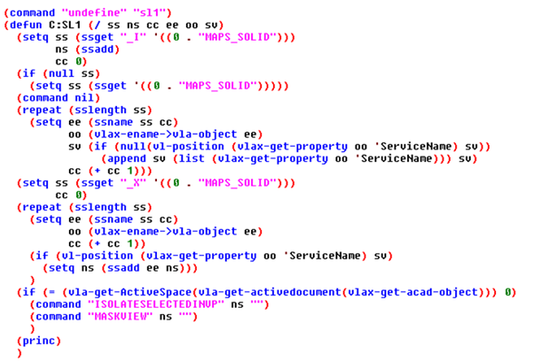
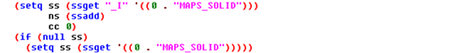
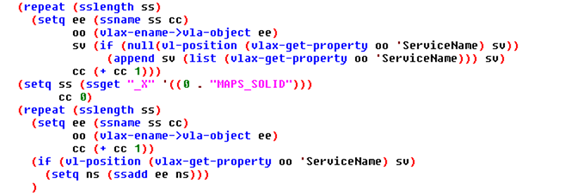
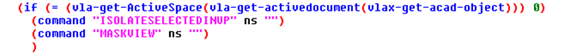

A while back I was reading the [Autodesk Fabrication Idea Station](https://forums.autodesk.com/t5/fabrication-ideas/isolate-selected-service-in-viewport/idi-p/6241909) and I saw a request that caught my eye. I think the reason why it stood out was because it was so obvious. I actually immediately went to work making the idea a reality. I think the requested function took all of about 15 minutes to build and test.

I figured anything that took me a few minutes wasn't worth hording and now I am sharing it here. If you are a Fabrication user, then you've probably used SL1 many times a day ever since learning it existed. What this function does is isolate all objects on specified services based on a selection set. It works great and fabrication is chalk full of useful visibility tools, but for some reason they left this particular void in the software.

Let's look at the code. You can click the image to download the lsp file.

Now that we have the code, let's talk about what I did to accomplish this and some of the subtle, but helpful behaviors I embedded in there. Note that the attached code also contains an SL2 that works in viewports.

The first thing I did was undefined the SL1 command so ours could replace the native definition. This is not necessary, but I don't see a particular problem with it and honestly in the 2017 release this seems beneficial; SL1 seems to be taking too many liberties in that release. Also note that these calls to undefine the original commands assume that you have the provided LSP and the fabrication ARX file loading on startup.

Next I detect if the user preselected objects using the "Implied" method of SSGET. Which helps us emulate the nature of the native command. *This is a best practice I advocate for whenever building any routine for public consumption.* Immediately after that, we test to see if the user did not provide an implied selection and in that circumstance we then ask for a selection.

Next we analyze the user's selection using the (read-only) exposed "Service" property. In this process we are forming a list of the service or services selected. Once we have the list of services we want to isolate, then we create a selection of ALL fabrication objects on those services to perform the "InVP" command on.

Finally we have to issue the command, but I took special care to issue the correct command. This is important because we have effectively removed the original version of SL1. In order to determine which command to issue we have to know if we are in model space or paper space. We do that with some more VLA magic by issuing a VLA-Get-ActiveViewport request. If it returns 0 then we know we are in paper space and we need to issue the "InVP" version. We maintain the original functionality of SL1 by issuing the standard "Maskview" command if we aren't in paper space.  
*Note: We can also determine if we are in paper space by testing the "CVPORT" system variable. Paper space returns 1.*

As I am writing this I have realized that there is a general void of information on the VLA-Property exposure of CADmep objects and I intend on detailing those at length in a future post. In the mean time I hope this example is both useful and informative. I'll be sure to come back and link that post here when it is available, but until then feel free to provide any feedback or report any issues you may have with the provided code.
