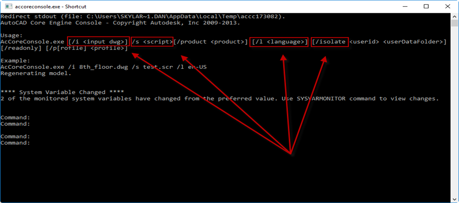
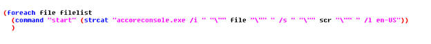

AutoLisp is a very convenient tool for making custom commands and automating tasks, but there are some trade-offs that are made when working with the convenience of the built in Visual Lisp IDE. One limitation is using Autolisp to perform functions in an MDI environment (Multiple Document Interface). This can make doing some tasks on multiple drawings very slow for large documents, or impossible depending on the task that is being performed.

Let's say for example that you need to detach all Xref's from a list of DWG's. I know what you're thinking, "Well I'll just use scripting". While this does work, depending on the size of the DWG, number of DWG's and size/number of Xref's that need to be detached, it could potentially bind up AutoCAD on your machine for quite some time.

Another solution to this would be using .NET. .NET is an efficient solution, and a very powerful tool, but in my opinion being able to use the VLIDE inside of AutoCAD is much more convenient to write something for more trivial tasks.

So what is the AutoCAD Core Console? Core Console is basically a stripped down version of AutoCAD from a User Interface perspective, while still maintaining almost all of the programs functionality. This lends itself to being useful when performing Batch Processing on large complex drawings. The .exe for core console is located in the AutoCAD install folder and is named accoreconsole.exe. If you open it up you will notice that it resembles any other console based I/O application. But don't let the lack of ribbons and toolbars fool you. Almost all of the power and functionality of AutoCAD is still at your disposal.

It is important to note that almost all GUI (Graphic User Interface) oriented operations will not be available from Core Console. This includes the File Dialog. You may notice that if you attempt to open up a drawing using the "open" command from the console, nothing happens. As far as I am aware, you can only open drawings from using the command line switch that if fed into core console when initiating the application from AutoCAD (or another program). These command line switches are shown at the top of the screen when you first open up the core console:

/i: Specifies the drawing to run a script file on

/s: Specifies the script file to execute

/l: Specifies the language pack to run

/isolate: Used if you do not want changes to the system variables to affect all AutoCAD documents (localizes the system variable changes to the instance of Core Console)

In order to run Core Console from AutoCAD, you can simply use the "Start" command either in the command prompt, or through the "command" function in Lisp. When starting the console from AutoCAD, there is no need to provide the entire path. Below is a code snippet that illustrates how to open a drawing named "Example.dwg" and run a script named "DoWork.scr":

## Through the command line

&nbsp;

## Through Lisp:

You can see how easy it would be to pass a list of full DWG paths into CoreConsole and execute a script:

Below is a short routine that can be used to experiment with running a script through core console on all of the DWG's in a user specified file directory (Click on image to download LSP):

***Note***: If you do not want to run the script on all dwgs in a specific directory, or if you want to run the script on files in multiple directories, the [Lee Mac Get Files Dialog](http://www.lee-mac.com/getfilesdialog.html) is an excellent tool.

Since Core Console is so lightweight on performance demand (when compared to full AutoCAD), you don't have to worry about passing several large DWG's into the "dwgList" variable; Your operating system will manage what processing power goes where, and how many consoles open up at one time. While AutoCAD is well known to not be multi-thread safe, each instance of Core Console is, in essence, a separate instance of AutoCAD. This make it easy to utilize more of the available threads on your machine to do work.

You can use or call standard lisp functions from the scripts that are fed into core console. Unfortunately, ActiveX is not supported through the console, so if you have existing lisp routines that you want to run on a batch of drawings, they will need to be modified to work without the use of ActiveX before calling them through Core Console.

Below is a simple script that you can use to get started. Used in conjunction with the Lisp example above, it will plot all of the drawings in a user defined file path. After you become familiar with the command line switches, as well as what commands/Lisp functions can be executed through core console, it really becomes a matter of writing regular scripts (.scr files). (Click on image to download SCR):

<!-- In the attached video I am plotting 20 .dwgs. Pretty cool huh? What's better is that if I was plotting, oh let's say 100 .dwgs, the current instance of AutoCAD that the lisp was initiated from will be available after all of the Consoles have been started, not completed. -->

<!-- VIDEO - Need to embed coreconsolebatchplot.mp4 (file size may be too large) -->

Hopefully this post has given enough information to allow you to start experimenting with the AutoCAD Core Console and the time saving batch possibilities that it supports. Please leave a comment below with feedback or questions. For more information, here are a few links to several excellent posts on the subject:

[Through the Interface: "The AutoCAD 2013 Core Console"](http://through-the-interface.typepad.com/through_the_interface/2012/02/the-autocad-2013-core-console.html)

[Through the Interface: "Commands that 'work' in AutoCAD Core Console 2013"](http://through-the-interface.typepad.com/through_the_interface/2012/03/commands-that-work-in-the-autocad-2013-core-console.html)

[AutoCAD Tips: "Up and Running with the 2013 Core Console"](https://autocadtips1.com/2013/01/30/up-and-running-with-the-2013-core-console/)
