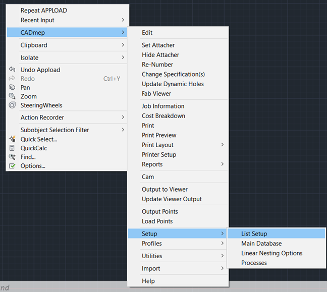
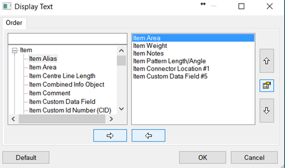
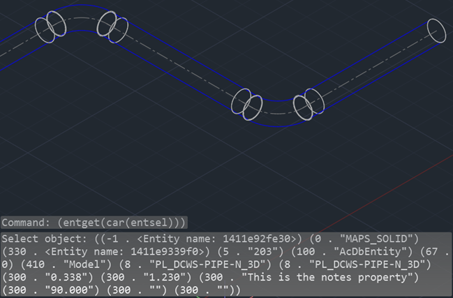
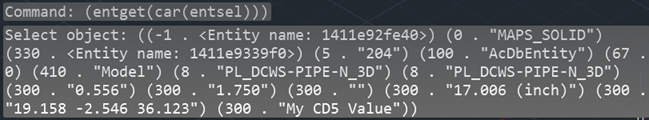
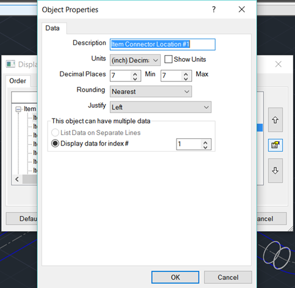
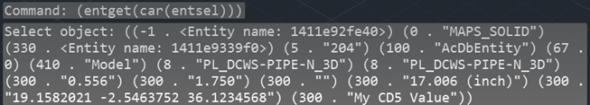

For many years there has been a rather undocumented (read-only) information powerhouse living within the Autodesk Fabrication package. I have even found references to its existence dating back to 2004. Unfortunately, I must admit that I had been doing many things in a much less accurate and more difficult way than I needed to, prior to diving into this. This powerhouse is the Fabrication List Setup tool. Fabrication utilizes DXF Group Code 300 to store Fabrication properties, and List Setup, defines which properties are shown in the 300 group code. This post will document the **List Setup** dialog, why I prefer it as a primary source of information for Fabrication parts, its limitations and some philosophical ways to use it properly.

*Before I dive too much into this topic I need to make a quick disclaimer. I am fully aware of the recently added .Net interface for Autodesk Fabrication and know that it is a powerful tool, but here is the crux…. I went to Autodesk University and sat through a class where the lesson plans read an all too familiar process of using one language to write another (COD) and to execute those to accomplish something. It is safe to say I was and still am disgusted by this workflow and am currently waiting for the .Net interface to mature before I try to use it as the backbone of anything beyond my curiosity.*

To get started we need to access the List Setup dialog and this is done through the right click menu:  
**Right Click -> CADmep -> Setup -> List Setup**

This should be fairly familiar because it shares similar functionality with other commonly used Fabrication dialogs; such as CADmep Report creation. On the left you have a set of properties that "could" be made available and on the right are the ones you have made available. Use the various arrow keys to move items from one side to the other and the up/down arrows to adjust the order of the items in the right pane. Between the Up/Down arrows you will find the **Edit Object Properties** dialog button. Take note of this as it is useful for various things that we will cover later. Also, note that the order of the items can be anything, but I would highly suggest putting careful thought and planning into this part of the process.

After you have gone through and selected all the attributes you wish to expose, the CDDETAIL.MAP file in the root of your database will either be created or updated. This is important to know simply because any lisp routines you create using a specific CDDETAIL configuration will most likely require that exact configuration to work properly in the future. With that said, I will discuss my solution to this versioning problem, however, I will not be providing my (proprietary) solution. At the most fundamental level, what I did was create 2 lists that effectively map the 300 group code indexes to a keyword. My routine accepts a keyword instead of an index, and then swaps the keyword and the current value of the index. This lets me create lisp routines that are standardized around keywords rather than specific indexes and thus all my routines are constrained only by my 300's management routine. This has worked exceptionally well for me and I would gladly release this for public use if Autodesk would further develop the List Setup output. This is badly needed because not all things are currently exposed, some of which are very important low hanging fruit, like service name. I have an [idea station post](http://forums.autodesk.com/t5/fabrication-ideas/list-setup-ehnhancement/idi-p/6292435) about this issue and I encourage everyone to go +Vote this entry to get this some love from the dev team.

Here is a list of things you will not find in the 300's List Setup dialog, but should be there. Note that I am using the @ symbol to denote access through VLA and the $ symbol to denote access through COD Scripting.

- Service Name (@ $)
- Status (@ $)
- Midpoint (@, but it is of lesser precision than typically found in 300 DXF)
- DatabaseID ($, which makes it unobtainable through ObjectDBX)
- ServiceType ($, which makes it unobtainable through ObjectDBX)
- Full ITM Path ($, which makes it unobtainable through ObjectDBX)
- ITM Options ($, which makes it unobtainable through ObjectDBX)

Other than that list, you will likely find what you are looking for in 300 DXF group codes. Let's look at the output of the DXF code we setup using `(entget(car(entsel)))` on an elbow. In the prior image of our dialog, we had Area, Weight, Notes, Length/Angle, Connector 1 Location and Custom Data Index 5 selected in List Setup. In reference to the 300 DXF group code, that is exactly the sequence of the output we see in the image below.

So, why didn't we get a value on the Connector 1 of the elbow? Well, that particular CID makes use of connectors 2 and 3, but not connector 1. So, this is a fine example of how the information is there, but you need to expose a lot of information in order to truly make use of the 300 codes.

We will perform this same task on a piece of pipe in a minute and you will see an XYZ point list where the connector 1 location output should be, but first, let's quickly revisit the topic of management first. In my proprietary 300 management lisp, I have 5 connectors and 10 out of the 14 available connector properties added to my exposed list. That is 50 DXF outputs entirely dedicated to connectors. Without a management system in place it would not be practical to make that much information available and useable. Also, Fabrication only reads the CDDETAIL.MAP when Fabrication is first started, or when List Setup is edited. This makes it impractical to do anything other than expose absolutely everything ahead of needing it and then managing the process of obtaining specific pieces of that information as needed. It certainly makes it impossible to do hot swapping of specific CDDETAIL map's for specific routines to execute.

Okay, let's look at the pipe now. As you can see, I have filled out the Custom Data index 5 value this time.

Now we see that there is indeed an XYZ point and my CustomData field is reporting a value. Unlike the other 2 forms of collecting information, VLA and COD, we also have direct control of the DXF output precision. We can do this by using the "Edit Object Properties" button located between the Up/Down arrows of the List Setup dialog box. If you look at the image below, you will see that I have changed my Minimum and Maximum values to be 7 decimal places; the default is 3 decimal places. It would appear as though 7 decimal places is the limit the software will give us, but that has been more than sufficient to suit all of my needs. Honestly, 5 decimal places would probably be fine for the majority of us BIM dogmatic types. In addition to letting us change precision of output, this dialog also lets us regulate items that could have multiple indexes. Some examples of this would be Custom Data, Dimensions and Connectors.

Note: Custom Data values can be assigned ***any*** index in the database when defined and those are the indexes I advocate specifying in List Setup, but unused indexes will be filled by an index of higher value where nothing else is defined. Example: If Custom Data Indexes 1, 2, 3, and 10 are the only defined Custom Data properties in the Main Database, and you provide only those four criteria in List Setup, the 300s group codes will only return those 4 indexes, and not the blank or unused indexes in between. Therefore, Index 10 can be read by specifying Index 4 (lowest numbered, unassigned database index) in the Edit Object Properties dialog.

After adjusting the precision, we can again call up the DXF data and see that the connector 1 value has indeed become 7 decimal output.

So if we wanted to actually work with this as a point in LISP, then we would need to get and then convert this string value into a list. Note that the evaluated list in the next image is back to displaying 3 decimal places, but that is in because of the AutoCAD command line limitation; all 7 decimals of precision are indeed tracked just not displayed.

This brings us to the next major reason for managing the 300's output; data type conversions. If you look at this output data, every single value in the 300 DXF codes are string representations of numbers and lists in the case of a XYZ points. By offloading the management of these values, we can let a singular system handle both the data requests and all of the conversions from string to list, integer or float for us. Hopefully at this point you can see just how critical it is to manage the DXF output and will join me in +Voting the reform of List Setup on the [Fabrication Idea Station](http://forums.autodesk.com/t5/fabrication-ideas/list-setup-ehnhancement/idi-p/6292435).

All of that is great stuff, but why should we gravitate towards the use of 300 DXF codes for data collection instead of VLA or COD scripts? The biggest reason, would have to be speed! Often, a script has to be dynamically written to suit the need for variables and even after you've taken the time to orchestrate that trick, the operation of running the script takes substantially more time to execute. If you want the information back in lisp then you have to do more work collecting that information from the only read/write VLA property available, which is Notes. The other lisp exposed form of information is VLA properties, which are quite limited in what they can provide, but they are indeed faster and less messy to use than COD scripting. Note that the overhead associated with creating a VLA object is still very slow by comparison to simply making the information available to native lisp as DXF codes.

The second major reason to use DXF instead would be accuracy. Through scripting I have found numerous values to be of a rounded nature whereas the DXF values are completely intact and can often return higher precision values when setup properly.

The third major reason is the absence of COD scripting through ObjectDBX. For power users like myself, it is a big deal to have access to a labyrinth of accurate information when data mining on many drawings. Also of note, the presence of the 300 DXF group codes and proper setup of the available information makes it possible to do very efficient list searching and/or initial filtering through SSGET filters on the front end of lisp routines.

For the sake of completeness of this post, I also need to debunk the character limit issues I've read about. I cannot speak about prior versions, but as of the 2017 release that I am using during this post, there no longer appears to be any notable character limits. I have put 2100 characters into both the Notes and Custom Data fields successfully, and was able to access all 2100 characters through the DXF output. If there was a limit at one time, then I can say it should no longer be a factor. I can't think of a good reason to put a dissertation on a Fabrication part, but you could if you wanted as of 2017.

In closing, to effectively use the DXF group codes it will require good planning, lots of setup and the creation of a management system for your routines to reference. This may sound like a lot of work, but the benefits are absolutely liberating. By implementing this process, I have made many nice to haves into true realities in a very short timeframe and consider this to be my most valuable tool. I feel that our very successful work on [#ProjectHoneyBadger]() is proof that with lots of good information and a wild imagination the possibilities are endless.
