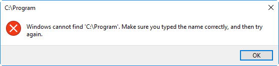

AutoCAD Plant 3D is a fairly robust program with one well-known and useful feature, which is the production of complete isometric drawings directly from model content. Plant 3D utilizes the PCF file format which is a standardized text file that contains information describing the pipe and fittings in the model. Plant 3D also uses its own standalone application to process these files into isos, called PnPIso.exe. If you use any of the iso production commands in Plant 3D and open your task manager, you will see that the PnPIso.exe process will be running and will terminate as soon as the drawings are produced.

A few days ago, a colleague sent a screenshot of a post from Peter Quinn, the Plant 3D Product Manager at Autodesk, in which he briefly discussed initiating the Plant 3D PnPIso.exe through Python scripting (see below). I searched far and wide for the post to see if there was any further information but was unable to find anything at all related to the subject. Being of curious mind, I decided to dig a little deeper.


Unfortunately, it was not as straightforward as I had hoped, and as previously stated, there is virtually no information available on the subject. Running PnPIso.exe from the command line and getting a list of arguments as stated in the post did not work. In fact, running the exe from the command line in AutoCAD or Windows provided the same result as double-clicking on the application, which is a very brief flash of a console and immediate termination of the process. However, by creating some generic folders on a local drive, and testing various forms of syntax for the arguments, the exe eventually ran. The minimum requirement for the console to load is the /config: argument. This tells PnPIso.exe which IsoConfig.xml to load.

Method #1 - `(command "start" "pnpiso.exe /config:")`

This method is a little bit tricky. Due to the fact that commands issued through the LISP command function are processed by LISP in a different manner than they are processed by the command line means that the exe path cannot contain spaces. This is a little tricky since the typical installation of Plant 3D is at \<drive\>:\Program Files\Autodesk\AutoCAD 20##\PLNT3D\PnPIso.exe. The example below demonstrates running the application through Windows Run which does not work when formatted for and issued through LISP.

Note: All examples below show the arguments on separate lines for clarity only. The application path and arguments should all be separated by a single space. Click <a href="/assets/misc/PnPIso-WinR.txt" target="_blank">HERE</a> for the text file.

C:\Program Files\Autodesk\AutoCAD 2017\PLNT3D\PnPIso.exe

/config:"C:\Autodesk\Plant Project\Isometric\HOB_ANSI-B\isoconfig.xml"

```lisp
(command "start"
"C:\\Program Files\\Autodesk\\AutoCAD 2017\\PLNT3D\\PnPIso.exe
/config:\"C:\\Autodesk\\Plant Project\\Isometric\\HOB_ANSI-B\\isoconfig.xml\"
")
```



Providing escape characters to wrap the application path does not work either. It doesn't seem to recognize the string and simply exits the function.

```lisp
(command "start"
"\"C:\\Program Files\\Autodesk\\AutoCAD 2017\\PLNT3D\\PnPIso.exe\"
/config:\"C:\\Autodesk\\Plant Project\\Isometric\\HOB_ANSI-B\\isoconfig.xml\"
")
```

The inability to run the application with the command function through LISP can be remedied by adding the path to PnPIso.exe to the Windows System Variable "Path" (System>Advanced System Settings>Environment Variables [System Variables [Path]]). By doing this, the path can be removed from the function call leaving only the application name.

```lisp
(command "start"
" PnPIso.exe /config:\"C:\\Autodesk\\Plant Project\\Isometric\\HOB_ANSI-B\\isoconfig.xml\""
)
```

This is a functional solution, but a slightly awkward one. If the user group was large, the need to change the Environment Variables on multiple machines would make this cumbersome. One upside is that it ensures that everyone is pathed identically. This can also be pathed to a server installation, which would allow multiple users to use the application without the need to install Plant 3D on every machine.

Method #2 - `(startapp "pnpiso.exe /config:<file path>")`

This is a much neater method as it doesn't require Environment Variables to be set. Spaces are not evaluated in this function so providing the full path is perfectly acceptable.

```lisp
(startapp "C:\\Program Files\\Autodesk\\AutoCAD 2017\\PLNT3D\\PnPIso.exe
/config:C:\\Autodesk\\Project\\Isometric\\HOB_ANSI-B\\isoconfig.xml"
)
```

Using this particular method would also allow for dynamically changing the path in the routing. Situations such as a newer version installation, working remotely, or with a local installation, server path changes, etc can all be handled by allowing for dynamic pathing without the need to modify Environment Variables.

Arguments

The arguments are fairly straightforward. They are simply strings resembling paths. Oddly enough, these do need to be wrapped in escape characters if the path contains a space.

/config:\<file path\> - Full path to the IsoConfig.xml. The xml must be contained in this path.

Acceptable - /config:\"C:\\Autodesk\\Plant Project\\Isometric\\HOB_ANSI-B\\isoconfig.xml\"

Not Acceptable - /config:C:\\Autodesk\\Plant Project\\Isometric\\HOB_ANSI-B\\isoconfig.xml

Not Acceptable - /config:\"C:\\Autodesk\\Plant Project\\Isometric\\HOB_ANSI-B\"

[INPUT] - Specifies the input file or folder

This argument will accept a full file path, or a folder path.

C:\\Autodesk\\PCF\\Test-Iso-01.pcf

C:\\Autodesk\\PCF

\"C:\\Autodesk\\PCF Files\"

A word of warning about this argument. You are able to supply a folder as the argument, but if a folder is provided, ALL PCF files located in the folder will be processed. This can be dangerous if you have a central location where all PCF files are located. Also, make sure that the closing delimiter for the folder path is excluded.

Acceptable - C:\\Autodesk\\PCF

Not Acceptable - C:\\Autodesk\\PCF\\

[OUTPUT] - Specifies the output folder

File path for DWG creation. Same criteria as all other paths; escape characters for paths with spaces, and no closing delimiter.

Here is a complete script for you to play with and modify to your liking.
Click <a href="/assets/lsp/HOB_PnPIso.lsp" target="_blank">HERE</a> for lisp

```lisp
(startapp "C:\\Program Files\\Autodesk\\AutoCAD 2017\\PLNT3D\\PnPIso.exe
/config:C:\\Autodesk\\Project\\Isometric\\HOB_ANSI-B\\isoconfig.xml"
C:\\Autodesk\\PCF
C:\\Autodesk\\DWG
)
```

Don't forget, these are all strings, so feeding variables is completely acceptable. The getfiled function makes it pretty easy to make this script dynamic.

This has been an amazing discovery for our current workflows. We currently use Autodesk Fabrication for all of our model content and only use Plant 3D for iso production. Considering that all of the customization of the Plant 3D iso process is done entirely through the xml's and vanilla AutoCAD, this has allowed us the option of never actually opening Plant 3D again. I will also say that although Plant 3D also initiates the PnPIso.exe for all iso production, and therefore should run at the same speed as running the process independently, I have not found that to be entirely accurate. The only explanation would be that Plant has a built in reactor to watch the process and notify the user when the process has completed, as well as providing dialog information about the production process once complete. The time savings is marginal but "a second saved is a second earned"….or something like that.

NOTICE: This post is not complete. The intent was to get the information out there as soon as possible for anyone currently searching for it. This post will be updated with .NET and possibly Python implementations as well.

Stay tuned for more excellence!