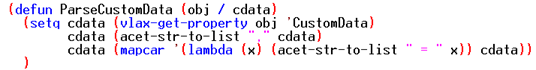

In the 2000 release of AutoCAD we saw the introduction of Visual Lisp and it was very large leap forward that I couldn't possibly convey the magnitude of its importance. This release brought Lisp wrappers for ActiveX/COM objects and the ability to properly debug a LSP file in a true IDE. An object of any kind has some form of basic method and/or property because everything derives from more fundamental object definition. When 3rd party (or vertical) objects are created they will receive some form of VLA exposure just by deriving from a base form like AcDbObject, but in the case of CADmep we were specifically given a several important ones beyond the standard implementation. These have served me quite well and I hope to document how you too can leverage their power. Throughout this post I will cover what VLA properties are, which CADmep properties are exposed, why they are important, where you are already using them and how to better use them moving forward.

## A brief introduction to VLA-OBJECT's
Before we dig into CADmep properties specifically, we need to get an understanding of what a VLA-Object is. If you're reading this blog, I assume you already have a degree of Lisp background. So, let's start by stating that the VLA-OBJECT is another representation of an ENAME, but instead of accessing DXF we instead work with Properties & Methods. Another important relationship to understand is that VLA Objects are essentially Lisp exposed wrappers around the same objects, methods and properties found in VBA. So, if a VLA-OBJECT is essentially the same thing, then that means that the VBA reference packaged with AutoCAD is technically our best documentation for VLisp VLA Objects. There are several links at the bottom of this post that can elaborate further on the fundamentals of VLA Objects, their properties and methods.

## Creating a VLA-OBJECT
In order to dive into CADmep properties, we need to first create a VLA-OBJECT. To do this we have to first cast an entity name into a VLA-OBEJCT. We do this by using the VLAX-EName->VLA-Object function on a drawn object in a model.

## Accessing CADmep Object Properties
Great, we now have an object, but what do we do with it? Well, the good news is that VLA objects are largely self-documenting. The bad news is we can't trust 3rd party or vertical objects to output that documentation accurately. I will explain this in detail, but let's look at the function that accomplishes all of this; it is called VLAX-Dump-Object. This function like all VLA function first accepts the VLA-OBJECT you want to work with and then accepts 1 more optional argument beyond that to modify its output. This secondary argument is whether we want it to show us methods as well as the properties the provided VLA Object supports. For the most part CADmep objects don't have anything special or unique about their Methods and the standard VBA/Lisp documentation can cover those. Here is a typical output of some random CADmep object when fed into Vlax-Dump-Object.

We will go through every single line of this output shortly, but let's talk about what we have here in general and why this should be self-documenting. The items in this list are all divided by an equal symbol. Fundamentally the property name on the left contains the value to the right of the equal symbol. If you examine this closely you will see the (RO) denotation of many of these. This stands for **R**ead **O**nly and denotes that we cannot write to this property. All the properties containing this RO are a direct result of inheriting from a more primitive object like we talked about earlier. There are several more properties that exist because of that inheritance and are writeable, but the only writeable CADmep specific property is NOTES. Because of that one string based property, we have the ability to pass information to and from the CADmep COD scripting language without writing everything out to text files. This is a critical advantage I will demonstrate in a later post.

***Note***: These VLA properties are already visible to basic users through the AutoCAD properties palette. Another important correlation to make is that many of these are the same properties that are exposed in Navisworks by the Object Enabler. In fact, all of these properties are exposed entirely through the Object Enabler. Because of this I was once able to make a set of Lisp driven annotation tools and subcontract the annotation of produced spools to a subcontractor that wasn't actually using CADmep.

## The Properties
Standard AutoCAD properties are prefixed with the * symbol. These native properties all have standard Lisp VLA-GET or SET-*PropertyName* implementations to work with, but the CADmep specific properties must be accessed using VLAX-GET-PROPERTY & VLAX-PUT-PROPERTY and there will be examples of this later.

- **\*Application**: This is quite literally AutoCAD itself and can also be obtained by using (Vlax-Get-Acad-Object)
- **Area**: This requires a bit of math in reference to the Length of a straight to use properly, but it can be a useful piece of information. At the bottom of this post there is a spreadsheet that details each CID and if the Area property is represented at all.
- **Custom Data**: This is where all CADmep Custom Data is concatenated into a single variable. This is an incredibly useful tool they gave us and will be detailed later with a nice code takeaway.
- **Description**: This is a combined version of both the ITM filename of the object in your model and the product list description/Name field contained in brackets. There will also be a code takeaway later.
- **\*Document**: This is the DWG object itself that our object resides in. This is essentially the parent (or owner) object of your current object. Generally, this is probably the most useful VLA Object Autodesk gave us when they implemented VLA.
- **Elevation**: This is a combination of your CADmep BOD/TOD text settings, applied Sections and the Units your drawing is set to. This can be an incredibly useful tool, but there are a labyrinth of settings and section combinations that dictate this outcome that will be specific to your setup.
- **EndSize**: This property could have been very useful if not for one major flaw. While there is value in knowing the connectors that are on the part and the number of connectors, the actual sizes provided cannot be used. For some reason they decided to round the provided sizes to the nearest integer; which makes them useless.
- **\*EntityTransparency**: This affects the opacity of drawn objects. I wouldn't recommend playing with this, but it could be useful given a specific situation. Give it a value of zero to make it non-transparent and a value of 90 to be almost completely transparent.
- **\*Handle**: This is the exact same value of ASSOC 5 in DXF code. This is a unique identifier that can be converted using HANDENT back into an ENAME.
- \*HasExtensionDictionary: I haven't seen any CADmep objects using extension dictionaries and unless you are wanting to add your on XRecords to Fabrication parts, then this is just a standard AutoCAD object dictionary reference that offers no actual benefits to us.
- **\*Hyperlinks**: This is the native AutoCAD implementation of Hyperlinks and does not represent the CADmep hyperlink implementation; they are entirely separate sets of hyperlinks.
- **ItemNumber**: Every CADmep object is automatically assigned a vacant/unused Item Number the moment it is created. We frequently give hangers a uniquely indefinable set of numbers to separate them from pipe & fittings. This can be useful information depending on how you use the CADmep item numbers.
- **\*Layer**: This is the exact same value found of ASSOC 8 in DXF code. Fabrication parts are actually many parts in a single object wrapper something like a block reference. Depending on your CAD Type and Service settings, each of those parts could reside on layers of their own. Which basically means that changing a CADmep object's layer doesn't usually provide the desired result.
- **LengthAngle**: I have found this to be an incredibly useful property with sloped systems. I use it to identify elbows that should be 89 and 91 degree fittings in BOM's. It isn't just good for that though, it is actually combination property that represents both length in straight CID patterns and the angle in many directional or offset CID patterns. At the bottom of this post there is a spreadsheet that details each CID and if the LengthAngle property represents Length, Angle or nothing at all.
- **\*LineType**: This is the standard AutoCAD Line Type implementation. You could set this to any value you want and it will override the standard value set in the layers manager.
- **\*LineTypeScale**: This is the standard AutoCAD Line Type Scale implementation. You could set this to any value you want and it will override the standard value set in the layers manager.
- **\*LineWeight**: This is the standard AutoCAD Line Weight implementation. You could set this to any value you want and it will override the standard value set in the layers manager.
- **\*Material**: This is the standard AutoCAD Material implementation. You could potentially automate the prepping models for presentation purposes with this property. I've never got around to doing this, but I've been thinking about it for a long time. I'll consider covering this in a future post.
- **Notes**: This is the single most valuable property they gave us. Not because of what it represents directly, but because they made it writable and it has no real bearing on the usability of a CADmep part. I intend on digging into this at length in a later post, but for the time being I'll tell you that I like to backup the current notes value using LDATA, write to this Notes property from Lisp, run my COD Script and then restore the Notes property from the LDATA backup after the fact.
- **\*ObjectID**: I've never really needed this. It is the VLA Handle implementation of type Vlax-VBLong. The value returned should uniquely identify an object and if you have it, then you can convert the ID value into a VLA-OBJECT using the VLA-ObjectIDToObject function.
- **\*ObjectName**: An Object Name is very similar to what we get out of ASSOC 0 in DXF code. It uniquely identifies an objects Class or Type. There are a few exceptions (Design Lines), but for the most part all CADmep objects are MapsContainer by name. We can use this to do work on CADmep objects while doing things with ObjectDBX where we can't pre-filter a selection for them up front.
- **\*OwnerID**: Again, I have never seen a particular reason to use ID's in lisp except for the prospect of passing it to arx, but this value represents the parent of the current object. In just about every CADmep situation I can think of this will be the ModelSpace VLA Object.
- **\*PlotStyleName**: This is the standard AutoCAD Plot Style implementation. You could set this to any value you want and it will override the standard value set in the layers manager.
- **Points**: This value will hold a string representing the XYZ of all valid end points and a midpoint if applicable to that CID Pattern. I wish they would revamp this to have more than 2 decimals of precision though! Still, I have been able to use these values quite affectively to audit user input to make sure they didn't provide an invalid point for whatever routine I was running at the time. There is a parse code takeaway later in the post.
- **Section**: Well, you know what a section is, but this is simply the name of the one assigned to your current VLA Object. Quite a few years ago I adopted the practice of adding the Elevation Datum value to the end of all my section names. This has made the offset values visible and usable in the lisp environment and I highly recommend leaving yourself that option moving forward; never know what situation will arise where it may prove useful.
- **ServiceName**: This will tell you what an objects service is set to. I have used this in a [previous post]() to demonstrate making an SL1 in viewports function.
- **Status**: This will tell you what an objects status is currently set to. Andy is preparing a post that will detail using this in the near future.
- **\*TrueColor**: This is the VLA representation of an AutoCAD color.
- **\*Visible**: This is actually the exact property that MaskView, ShowAll, etcetera is puppeteering for visibility states. I will point out that a -1 is actually a representation of :Vlax-True and that a value of 0 is a representation of :Vlax-False. I have made MANY custom visibility commands with this.
- **Weight**: This is tricky because it will vary depending on if it is a straight or a fitting. In the case of a fitting this can be taken literally, but in the case of a part it would have to be interpreted in conjunction with the LengthAngle property. Also note that this does not include the wet weight of the fluid or gas contained inside the object.

***Note***: All images of code are download links and downloading 1 vs another provides all examples.

## Custom Data Parse
At some point, AutoCAD started allowing variables to contain greater than 1024 characters and I have no idea what that limit is, but I know it is about 17 million characters; which will store just about anything. So, the entirety of the information contained in your Custom Data setup & on each individual object is visible through this property. The trick is getting to it. With a small amount of Lisp parsing we can ask an object to return a list of these values quite easily.

## Description Parse
Since this property contains both the Part Name & the Product Listed Size Description, it can be a very useful piece of information; particularly in the realm of ObjectDBX where may want to pull a BOM on a few hundred drawings. Let's create a simple function to separate these pieces of information. Note that I have deferred the creation of the VLA-OBJECT to whatever your base routine is. I did this because there is a certain amount of overhead associated with its creation and it is best to never create it more times than needed.

## Points Parse
While the information contained isn't the highest level of precision, it can be of great use for checking continuity, checking for slope, etcetera. However, first we need a way to get the data into appropriate point lists.

## Summary
I hope that this has been an enlightening article and that I have opened up some doors to new possibilities. I am quite certain this blog will be filled with examples utilizing VLA-OBJECT's to your advantage eventually. Please review the links at the bottom of this post for additional general information about VLA Objects. The provided spreadsheet documents some of the dynamic things useable through VLA by CID pattern, but note that CID's 35, 916, 2916 and 2979 are not represented. We used some .net magic to generate every CID between 1 & 5000 and automated inserting them into a model for VLA documentation. Those 4 CID's couldn't be inserted with minimal dimensional changes and thus could not be cataloged. If anyone has some functional parts based on these patterns and wants to share them, then please send them over. Until then, feel free to provide any feedback, ask questions or report any issues with the content covered here.

[VLA CADmep Values Table](/assets/misc/VLA_cadMEP_Property_Values.xlsx)

[Lee-Mac Overview of VLA Objects](http://www.cadtutor.net/forum/showthread.php?81195&p=551261&viewfull=1)

[VBA Documentation](http://help.autodesk.com/view/OARX/2021/ENU/)

[AfraLISP Properties & Methods Overview](http://www.afralisp.net/visual-lisp/tutorials/properties-methods-part-1.php)
