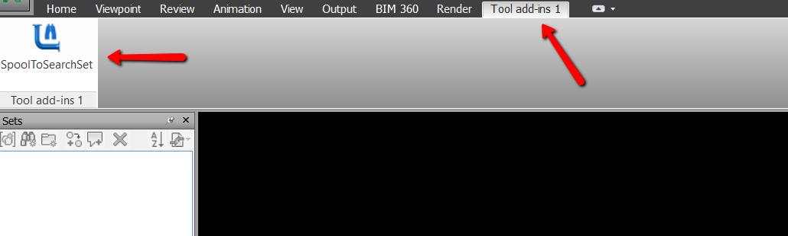
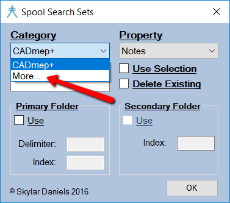
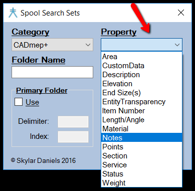
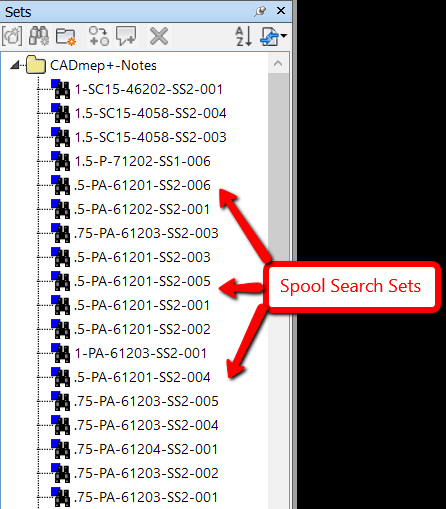
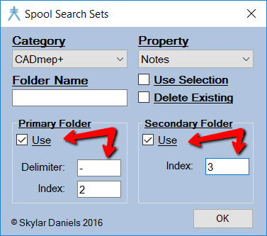
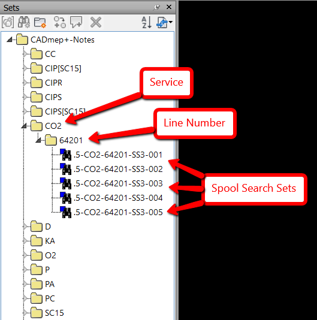
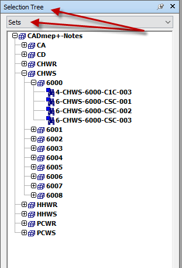

Many of the posts so far have been about AutoCAD customization and Autolisp tips, so I thought I would write a post about a workflow that you may be able to incorporate into your BIM process (this is after all, the "House of BIM"). I was introduced to both CAD and programming by another contributor to this Blog, but I am a union Steamfitter by trade. I have been in the field on BIM projects and have seen some of the challenges of making the connection between the Model and the job site. Let's say for example the craftsmen in the field attempts to install a piece of pipe fabrication and there is a bust (aka clash) with some electrical. The first step would of course be to make sure the fabrication is built to the dimensions on the spool drawing. The next step would be to locate the spool in the Model to see if all trades are installed per the approved coordinated model. Locating this spool on a large model can prove to be difficult, but with Search Sets, locating multiple spools in a model quickly is a trivial task. In this post we will discuss what Search Sets are, the benefit of Search Sets over Viewpoints for locating spools, and how to use the SpoolToSearchSet Navisworks Plug-In.

Search Sets are similar to selection sets, but instead of being a snap shot in time of the items that were selected, Search Sets "search" the database for specific criteria that is specified in that particular set. So if there is information that is exposed on the parts that you are appending into a Navisworks model, you can create a Search Set to select those parts which share the same information. The searchable database properties are shown in the "Find Items" Navisworks tool. An important part of creating Search Sets from the appended spools is making sure that the spool information is exposed in Navisworks. I am using Fabrication MEP at the moment and the "Spool Name" field on Fabrication parts is not exposed in Navisworks, but the "Notes" field is. The workflow that we use is to put all the spool names into the "Notes" field before saving our working models (DWG's). 

To download a tool to automatically put all information in the "Spool name" field into the "Notes" field for Fabrication MEP.

[Click Here for 2017](/assets/dotnet/Fabrication2017_Spl2Notes.zip)  
[Click Here for 2016](/assets/dotnet/Fabrication2016_Spl2Notes.zip)  
Load with "Netload" from a trusted location and type "spl2notes" in the command line.

Another option is to download the [Spool Name To Notes Field Script](/assets/misc/spool-name-to-notes-field.zip)  
Type the "ExecuteScript" command, select the downloaded .cod, and select all objects.

*Disclaimer: This will overwrite any value currently stored in the Notes property of your objects. If your current workflow uses the Notes property to store other critical data, please do not use this tool, as your information will be lost.*

Viewpoints are useful tools in Navisworks when it comes to saving and redlining views in the model. They are used by some contractors for helping the field locate spools. Some of the drawbacks of using Viewpoints to convey spool location to the field are they do not show the extents of the spool, they do not automatically update, and they can be time consuming to make. It can be difficult, depending on the location and size of the spool, to show where the particular spool starts and stops with a viewpoint. This is not a problem with Search Sets because the entire spool is highlighted when the Set is selected. The user can then hit the "Page Down" button on the key board or click the corner of the View Cube to zoom to the extents of that selection. The user could also use the Hide/Unhide selection tools. Another problem with using Viewpoints for locating spools is that they do not automatically update if there are Revisions to the spools. This can make maintaining up to date viewpoints for the field very difficult. Search Sets search for specific database parameters so no matter how many times the spool changes, the link from the named Search Set to the spool will always be there so long as the spool name stays the same. Depending on how they are initially made, viewpoints can take quite a bit of time. By using the tool shown below, Search Sets for spools can be created and maintained instantly.

To use the SpoolToSearchSet tool you must have Navisworks 2016 or 2017 Simulate or Manage installed.  
To download the app click Here: [Spools To Search Sets](https://apps.autodesk.com/ACD/en/Detail/Index?id=1190109394822676384&appLang=en&os=Win64)

Now when you open up Navisworks you will notice a tab titled "Tool add-ins 1" on the ribbon. Click on that tab and you will see a button titled "SpoolToSearchSet" with a picture of a piece of pipe and binoculars. Click on that button to bring up the Spool Search Sets dialog.

The Spool Search Sets dialog consists of a "Category" field, a "Property" field, a "Folder Name" field, "Use Selection" and "Delete Existing" check boxes, "Primary Folder" with both "Delimiter" and "Index" fields, and "Secondary Folder" with an "Index" field. This works on the same principal as the "Find Items" tool within Navisworks. The only difference is that it automates the organization and creation of Search Sets from properties with unique values (spool names). The only required pieces of user information are the Category and Property fields. If the "Use Seletion" check box is checked, only the current selection will be used to create the Search Sets.  To populate the Category field with all Category names in the model, select the "More…" field from Category dropdown list.  If you only want to use get the Category names from the current selection, be sure the "Use Selection" check box is checked before selecting "More...".  After you select the Category, the Property field will populate with all the Properties of that Category in the model.  You also have the option to further organize your sets into a unique parent folder with the "Folder Name" field.  If no folder name is specified, a parent folder with the name of the Category and Property fields will be created.  In this example we are going to use the "Notes" property of all of the Fabrication MEP parts in the Model. If you click on the "OK" button at this point, Search Sets with all of the unique names in the "Notes" field will be created under the folder "CADmep+-Notes" (because the "Folder Name" field was left blank, the Category-Property used will be the name of the parent folder). These settings will also be saved for the next time the tool is used.

  

  

  

There may be some cases where this is all that is needed. If there are several hundred spools in a model, it can make finding a specific spool tedious. This is where the "Primary Folder" and "Secondary Folder" fields comes in handy. The way these fields work is dependent on the structure of the spool name text itself. We will use the spool name "4-CPWR-12003-CS-001" as an example. Let's assume that all of the spools that we are going to create Search Sets for follow the same structure: Size-Service-Line Number-Spec-Sheet Number. If we wanted to create Spool Search Sets that are organized into Folders with the different Service names we can use the Primary Folders field. The "Delimiter" field will be the character that separates the different parts of the spool name. In this example the "-" character is used as the delimiter. The "Index" field is how the user specifies what part of the spool name to use for organizing the spools. In this example we want to organize the spools by Service so the Index will be "2". The "Secondary Folder" field works the same way, it just adds one more layer of organization to the Sets. In this example we can further organize the Sets by line number by using the "Secondary Folder" field with an index of "3" (according to the spool name structure in our example, the line number is the third index). If we then click the "OK" button, the spools will be organized by service and by line number. Below is an image of the above example. All of the users settings will be saved for the next time the tool is used. If the tool is ran again with the exact same parameters, it will not create duplicate spool Search Sets, so long as the folder structure stays the same. This makes it easy to maintain Search Sets for the duration of the project because as the project moves forward, and new spools are created, all the user has to do is run the SpoolToSearchSet tool and only the new spool Sets will be created.  You also have the option to delete the existing spools by checking the "Delete Existing" checkbox.  This is used if you want to make sure any empty search sets are removed from the same parent folder.

  
  

It is necessary to have Simulate or Manage to run the plug-in, but if you save the model as an NWD with all of the sets created, the personnel in the field can open the NWD and use the Spool Sets with the free version of Navisworks Freedom.

  

Thank you for taking the time to read this post and I hope that you found it useful. To recap, using Search Sets to help the field connect the Model to spool drawings can be a time saving addition into your BIM workflow. In order to get the most from the workflow used with the SpoolToSearchSet tool in this example, the spool names need to be set to a property that can be accessed from Navisworks, and the spool name structure needs to be the same for all spools.  Any feedback on potential bugs, improvements, or questions would be greatly appreciated.
