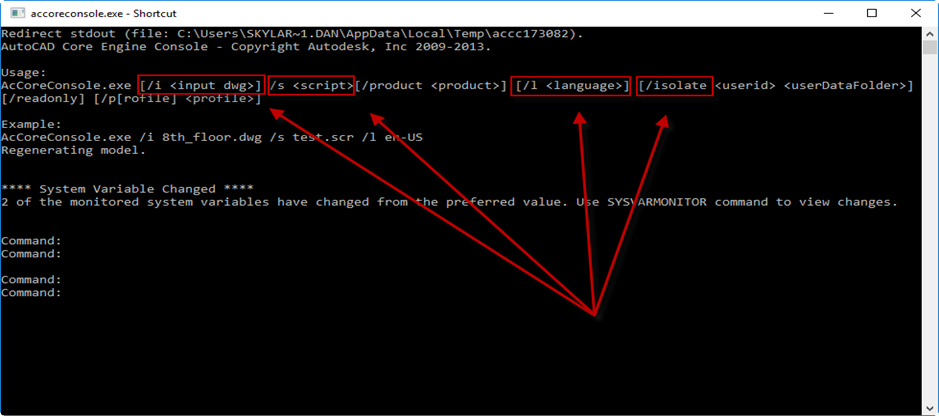
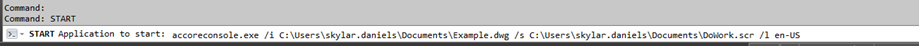
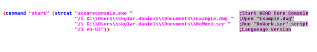
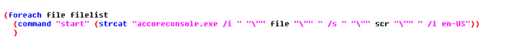
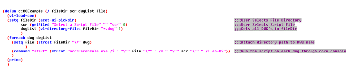
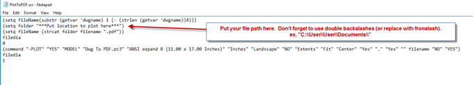

In a previous post, ["Son Of A Batch! AutoCAD Core Console Through Lisp"](), I wrote about how the core console could be initiated through Lisp to run batch operations on a group of DWGs with the use of Static and Dynamic Script writing. While learning .NET, I wrote a plugin a few months ago that was the inspiration for that Post so I thought I would outline and share that plugin here. The plugin is called SonOfABatch and has three batch processing capabilities. This post will outline the general layout of the plugin, how to change attributes, how to plot, and how to remove X-Refs from a group of DWG's. I am a Novice Programmer but with some research, it was not hard to find many useful resources online. I find that whenever I am researching how to do something in AutoCAD with .NET, I end up at the same site: [Through the Interface](http://through-the-interface.typepad.com/). It is an awesome source of information that I am thankful for and if you are interested in learning to use .NET to customize AutoCAD, I highly recommend checking it out.

[Click here to download from App Store](https://apps.autodesk.com/ACD/en/Detail/Index?id=3580251928718982393&appLang=en&os=Win32_64&autostart=true)

The command for SonOfABatch is "SOB". It can also be found in the Add-ins tab on the Ribbon. When the command is started, the main dialog window appears. In this window you will see an area titled "DWG list", with a button titled "Add Files" and a button titled "Remove Files". These will be the drawings that the batch operations will be performed on. On the right hand side there are three tabs titled "Attribute Changer", "Plot", and "X-refs". This is where the different batch utilities are set up and run from.

To change Attributes on a group of drawings the "Attribute Changer" tab needs to be active. In my personal experience, this is a handy tool to change or update Title Block information. In this tab there are "Parameters", "Replace" and "Search and Replace" fields. In the "Parameters" field, there are two fields where the "Block Name" and "Attribute Tag" to be changed are specified. There is also a Button titled "Populate Fields". In order to populate the Block and Attribute Tags from a DWG in the "DWG list" area on the left, you must select ***ONLY ONE DWG*** from the list and click the "Populate Fields" button. This will populate the "Block Names" drop down with all of the blocks that are inside of that particular drawing. Then when a block is selected from the "Block Name" drop down, the "Attribute Tag" drop down will be populated with all of the Attribute Tags for the specified Block in the DWG selected from the DWG list. You also have the ability to manually enter the Block name and Attribute tags.

Once the Block and Attribute Tags are specified, you can then replace the value of that Tag, or you can search the value of the Tag and replace a search pattern if it exists. To replace the value, simply input the new text in the "New Value" field in the "Replace" field and click the "Add" button. This will replace the entire value in the specified Attribute Tag with the new value. If you want to remove an entry, simply select the entry(s) to be removed and click the "Remove" button. In order to search for a pattern in an attribute value and replace the pattern with a new value, enter the text to be searched for in the "Search For" field in the "Search And Replace" field, and the value to replace that specific text in the "Replace With" field. This will search for the specified Tag name of the specified Block and test to see if the text pattern in "Search For" exists. If it does, it will replace that text with the new value. An example of what would make this feature useful is if your spool continuations were attributed blocks and something in the spool naming convention changed. You could then target the continuation Block and Tag and replace the part of the name that needs to change. In the image below, all of the Drawings in the DWG list will be checked to see if they contain a block named "Continuation" with a tag named "Contiso", and if that Tag value contains "CS", it will replace that text with "CSS". When all of the information is filled out, click the "OK" button to change the attribute values. There is also the option in import and export the attribute lists as XML's using the "Import List" and "Export List" at the bottom of the tab.

*Important Notes: The "Block Name", "Attribute Tag", and "Search For" value are not case sensitive. If a drawing is open it will not process that drawing.

To plot a group of Drawings, select the "Plot" tab on the right hand side of the window. This feature is useful when plotting several Iso drawings to PDF. The name of the PDF will be the DWG name itself, along with some optional additional text. The first field is "Plot Properties". Here is where either model space, or paper space is used to plot from. If model space is selected, it will plot the extents of the model space, with the plot style in the "CTB" field. If layout is selected, it will plot the layout in the "Layout Name" field. The "Populate Fields" button works the same in this tab as it does for the Attribute Changer. It will populate the "Layout Name", "Title Block Name", and "Rev Attribute Tag" fields with the values in the drawing selected in the DWG list.

Next is the optional "Revision Check". This is where you can check for a revision number and add that to the PDF name, along with a prefix. In the example below, the drawing will be checked for the block "11x17_Title_Block", with the Tag "REV" and that value, along with the prefix character, will be added to the end of the PDF name (ex. 2-HWS-CU-001_Rev0). The next optional field is "Additional Drawing Name Text". This is where additional text can be added to the end of the PDF name (after the revision text if selected). In this example, a PDF name would be something like "2-HWS-CU-001_Rev0_SCD".

The last optional field is the "Advance Options". Since Core Console is being initiated in the background, there is a set amount of time that this plugin is allowing the drawing to be processed before it kills the process. This default time is 30 seconds. If you are dealing with more complex drawings, it may take longer than 30 seconds to plot them. More time can be added with the "Additional Time Out (sec.)". There is also the option to use load dbx file in core console. The reason for this is because core console is based off of vanilla AutoCAD, so if you are plotting a drawing with Fabrication MEP objects, the objects won't be shown unless the proper dbx is loaded.

The final field is the "Plot Location" that the PDF's will be plotted to. Once this field is populated, the "OK" button is pressed and all of the settings are saved for the next time the command is started.

To detach X-Refs from a list of DWG's, the "X-Refs" tab needs to be selected. You can probably tell from the screen shot that this feature is not the most dynamic. It simply has the option to either detach the X-Refs that are "Attached" (not overlays) or to detach all X-Refs. I was going to add more functionality to this feature, but after doing some research I learned about a pretty cool tool that already lives inside of the AutoCAD install folder called "AdRefMan.exe". It is a standalone executable that will do just about anything you would ever want to do with X-Refs on a group of drawings (detach, attach, re-path etc.) Here is a link to a short YouTube video that outlines that tool: https://youtu.be/3safVjTaV8o

Thank you for taking the time to read this post. If you notice any bugs or have any suggestions on how to improve this plug-in, ideas for new plug-ins, or have questions about how this plug-in was created, please leave a comment or email me at: Skylar.Daniels@houseofbim.com
