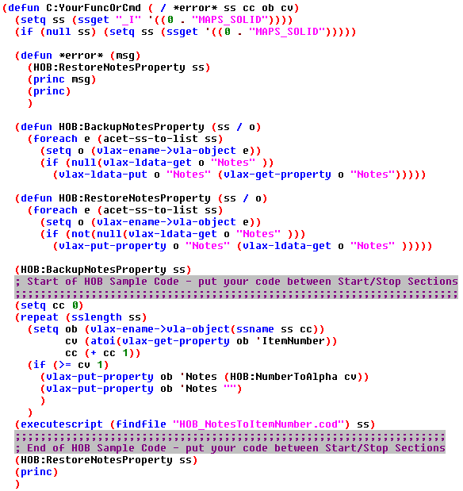
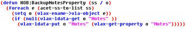
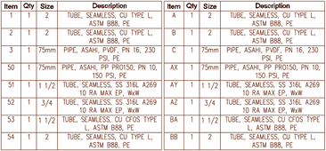

A while back I did an overview of the VLA properties Fabrication objects expose to us. If you haven't read that or aren't entirely familiar with Fabrication VLA properties, then I would suggest reading this first: [Autodesk Fabrication - VLA Properties Exposed]()

While I was composing that post it was clear to me that the Notes property would need its own post. So, without further ado let's talk about the Notes and why it is so important. Here are a couple bullet points:

- This is the only Read & Write property we have through VLA on Fabrication Objects.
- The Notes property is an ideal way to pass information to & from Fabrication COD scripts.
- By using Notes as the common information pass through we avoid writing information to text files and the information will always be contextually valid since it resides on the Object it pertains to.
- Prevents the creation of unnecessary amounts of COD scripts by passing valid data into the Notes for operations.
- By using the notes field for LSP/COD scripting you can't really use it for its original purpose unless we persist that data during our LSP/COD scripting calls.
- Probably the best place to leave arbitrary data intentionally for Navisworks viewing; IE. Spool Name.

I think that should about cover WHY we should be using notes. However, I am going to avoid all of that and just focus on solving the issue discussed in bullet point 5. By doing that the Notes property can be leveraged by lisp and still be valid for displaying specific information in Navisworks or even doing something crazy; like actually leaving notes pertinent to what you did and why at the time you modeled something...

My goal here is to provide a *"template"* that backs up the current Note values, provides a clear place for you to do work and then consistently restores the original Note values to the Fabrication objects. However a template is slightly boring and we will be demonstrating this template in the context of creating the alphabetic numbering feature CADmep is lacking. Generally, this image shows what I am suggesting you use for a template on lisp routines featuring COD scripting in the future; with a hint of sample code thrown in there. Note you can click the image to download the code and get access to the HOB:NumberToAlpha function being referenced.

## Get the Selection
The first part of the routine handles a selection set. If you are doing COD scripting you will need a selection set to feed it. Here I am suggesting that be your first order of business. This header is in just about every single lisp routine I write. We simulate the PickFirst feature of native AutoCAD by first checking to see if anything was pre-selected when the routine initiated. If it was, then we work with those objects, if nothing was selected, then we prompt the user for a selection.

## Error Handling
I am not really going to talk about error handling, but I will point out that ours is designed to restore our backups on the default selection. In the downloadable version I will likely switch this to target ALL Fabrication objects because it is the safer move if the routine actually hits the error handler. Also note that the *error* was localized and you should always be localizing your error handlers to protect the default AutoCAD version!

## Making the Backup
There are plenty of different ways you could go about saving the original Note values. This is a Visual Lisp related post and LDATA was a clear path for such a topic, but generally I do find the LDATA method preferable because it is very clean and concise.

  
***NOTE:*** There are multiple methods with notably better performance on very large models.

The most important thing this is doing is making sure the LDATA version of an objects Notes property doesn't already contain a value. This allows us to blindly and frequently send selection sets for backup on more complex routines. We don't even have to track what has or hasn't been backed up. Depending on your workflow this could be a detriment, but I would think you may be doing something wrong if that's the case. If you are in one of those very complex (lots of ssets) routines, then I would encourage you to change the ending call to HOB:RestoreNotesProperty to include ALL CADmep objects and not just the basic selection shown here. Like the HOB:BackupNotesProperty, the restore will not restore something unless it has something valid to do work with.

## ExecuteScript Function
One of the best gifts they gave us was scripting access directly from lisp. This CADmep Lisp function accepts a COD script path and a Selection Set; in that order to function seamlessly. The referenced COD essentially says "Item.Number=Item.Notes", but with a check to make sure the Notes property is holding a value. You'll notice in the sample code I am setting the Notes to an empty string if I don't want the script to do anything with that object. Finally, you should notice I am opting to use a (findfile) for the path argument and thus checking all the various AutoCAD Search Paths to locate that script. This is a method I frequently deploy, but you could hard code a path into it if you really want to pigeon hole yourself.

## Restoring the Backup
We literally flip the sequence of the backup for the restore fuction. So, there isn't much to say here that hasn't already been covered, but I will point out that an *IF* statement in there is making sure it only restores values that were actually backed up in the first place. We wouldn't want it wiping perfectly valid notes with a NIL. Also note that regaurdless of how complex you're routine is, there really should be exactly 1 call to the restore function; consider it practically the last thing you do.

## Sample Alpha Output
The scope of this topic isn't about this, but I'll explain what the giveaway does. Essentially, you renumber your parts however you always do. Then you would run this lisp routine on parts you've renumbered. It reads the numbered values in their VLA properties and if not already an Alpha numeric will convert it to letter equivalents. Note that the functions as provided can handle up to the number 702. Once you pass that threshold the alpha numeric would be 3 letters long and I just plain didn't go that deep and don't advocate this method for BOM's of that size. I see this as a practical way to keep the size of item bubbles minimal and consistently sized on spool drawings. Here is an example output that does show the before, the after and what life beyond item number 26 looks like.

## Conclusion
Many people have been in protest of utilizing this property for automation forever, but the truth is we just have to do it properly. Using this method we can easily do what needs to be done and still use the property as a detailers arbitrary digital note pad. If you have any questions or are struggling to get this to work let me know in the comments and I'll see if I can sort it out.
