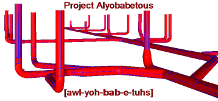

In a prior post I discussed my need to dig into the Plant 3D API for the purpose of converting P3D content into Autodesk Fabrication content. Well, it was a pretty huge success and works comparably to the Revit export workflow. Check out this Sch10 stainless underground conversion example. Blue is the original P3D content and Red is my CADmep converted content.  


I appropriately named this project after Zero Wing's iconic ["All your base are belong to us"](http://allyourbasearebelongtous.com/) phrase. Project Alyobabetous is indeed my Plant 3D converter, but that vague context is about all I'm going to share of my converter. I will however spend the rest of this post talking about the Plant 3D .Net plugin I made to extract the necessary information, provide the code to that plugin and some generic examples of how you might be able to leverage it.

## Disclaimer
I provide the following code entirely without any notion of support and it should be considered a starting point for your own projects. Your welcome to ask a question about it, but I don't feel any obligation to dig any deeper into Plant 3D's awkward API on your behalf than I already have. Also note that this thing works fine under specific context, but I probably have not error trapped for all types of potential P3D content or every improper way you could use the DLL and an <span style="text-decoration:underline;">AutoCAD Fatal Error is an entirely possible outcome by using it</span>!

## Downloads
Use this link if you want the C# project code that you have to compile:  
[HOB_P3DLispSupport_Project.zip](/assets/dotnet/HOB_P3DLispSupport_Project.zip)

Use this link if you just want the functional DLL to use at your own risk:  
[HOB_P3DPlugin.zip](/assets/dotnet/HOB_P3DPlugin.zip)

Autodesk Plant 3D SDK Link:  
[https://www.autodesk.com/developer-network/platform-technologies/autocad-p-id-and-plant-3d/](https://www.autodesk.com/developer-network/platform-technologies/autocad-p-id-and-plant-3d/)

Now that the legal and distribution aspects are over, we can actually talk about how to use these 2 lisp functions.

# GetPlantValues Overview
This function will give you access to all the "string" properties and port information of a P3D Part. Which, to the best of my knowledge everything inherits from the base class Part and thus should work for all plant objects. I have noticed that Plant 3D connectors are deviants in the quantity of strings available and I wouldn't be at all surprised if that holds true with other types of content. To combat those inconsistencies I made the output of this function a list of paired value lists. This way I could always know for sure which string property value I was looking at in my code.

### GetPlantValues: Syntax
```lisp
(GetPlantValues ename [string [string] . . .])
```

### GetPlantValues: Arguments
**Ename**: An entity name of a plant 3D object you would like to request information from.

**String(s)**
These are property names, but you can request ALL of them by requesting "*" and this should probably be done at first until you know exactly what you're looking for. This function doesn't care if you send it 10 string arguments or a single list containing 10 strings. 
*Note:* that this routine is not designed to enforce a return in the order in which you provided them.

### GetPlantValues: Return Values
A list containing paired lists of the PropertyName(s) and PropertyValue(s) you requested. The PORTS property is not part of the standard string properties the datalink manager provides and is a custom collection of Location and Vector points for each connector the P3D part contained. 
*Note* that the Location XYZ + Vector XYZ will give you a point exactly 1 unit distance away from that connector's XYZ location in its native planar direction.

### GetPlantValues: Examples
```lisp
(GetPlantValues ent "PARTSIZELONGDESC" "WEIGHT")
(("PARTSIZELONGDESC" "ELL 90 LR SCH 10S 304/304L SS A403-W 4") ("WEIGHT" "8.9"))

(GetPlantValues ent (list "MATCHINGPIPEOD" "LINENUMBERTAG"))
(("MATCHINGPIPEOD" "4.5") ("LINENUMBERTAG" "D‍N‍00001"))

(GetPlantValues ent (list "WEIGHT" "PORTS"))
(("WEIGHT" "8.9") ("PORTS" ("S1" ((37987.0 62838.1 6558.0) (-0.999946 0.000646985 0.0104161))) ("S2" ((37993.0 62832.1 6557.94) (-0.00064702 -1.0 6.75919e-19)))))
```

# SetPlantValues Overview
This is my meager attempt at giving fellow lispers the ability to change something. It has been a few years since I've tried to actually work with plant 3D on a project, but I vividly remember the act of an Entmod fatal erroring Plant3D at the next save. This function will make an attempt at a single property value change on an entity. I say attempt because I know some of them seem to be read only; like size. I didn't really need this for what I was doing and thus haven't tested it extensively, but the C# code is available if you want to roll up your sleeves and make better.

### SetPlantValues: Syntax
```lisp
(SetPlantValues ename PropName PropValue)
```

### SetPlantValues: Aguments
  - **Ename**: An entity name of a plant 3D object you would like to change information on.
  - **PropName**: A string representing any of the Property Names provided by the GetPlantValues function using "*" except PORTS.
  - **PropValue**: A string representing the new value of you want the provided PropName to hold.

### SetPlantValues: Return Values
It returns (T) if the PropName existed and made an attempt to set your provided value. It returns (nil) if the provided PropName was not found and would mean no attempts to do work were made. Note that a return of (T) does not necessarily mean the value took. You will have to do your own research to see what does and doesn't have write access. The good news is I haven't personally seen it crash from trying. So, it should be safe to poke and prod as much as you want.

### SetPlantValues: Examples 
```lisp
(GetPlantValues ent "LINENUMBERTAG")
(("LINENUMBERTAG" "D‍N‍00001"))

(SetPlantValues ent "LINENUMBERTAG" "E‍N‍10001")
(t)

(GetPlantValues ent "LINENUMBERTAG")
(("LINENUMBERTAG " "EN‍10001"))

(SetPlantValues ent "HOUSEOFBIM" "E‍N‍10001")
(nil)
```

### Used ACAD .Net References
- accoremgd.dll
- acdbmgd.dll
- acmgd.dll

### Used P3D .Net References
- PnP3dObjectsMgd.dll
- PnP3dProjectPartsMgd.dll
- PnPDataLinks.dll
- PnPDataObjects.dll
- PnPProjectManagerMgd.dll

# Recap
Well, I certainly hope this enables somebody out there to make Plant 3D do something really cool against its will. Plant is easily the most over managed AutoCAD based piping software I've seen and that over management could render this utility good for nothing more than a .Net P3D project example, but at least I tried to help fellow lispers. If anyone does manage to do something cool with it please let me know about it in the comments. I'd really like to know this simple .Net implementation helped a struggling automater in some way.
