This post started back in October 2016, when I found a question on the Autodesk Fabrication Forum regarding viewing objects Status color outside of the Fab Viewer. It appears that that particular post on the forum has been removed, but I thought I would address the problem for anyone else who may have that question.

For those who don't know, the Fab Viewer in Autodesk Fabrication allows you to view the Fabrication model content and apply what I would refer to as Appearance Profiles similar to the Appearance Profiler in Navisworks. There are additional commands and functions that are available in the Fab Viewer which are not available directly through the model, but that is a topic for another post. The Fab Viewer can be accessed through the CADmep toolbar or by issuing the "FABVIEWER" command.

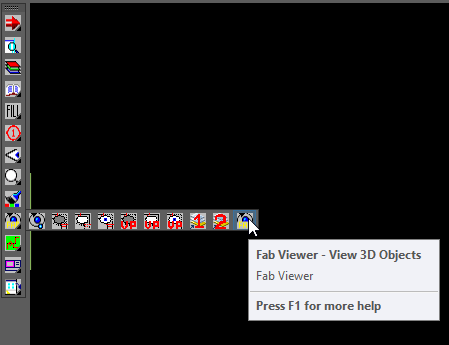

In the example shown below, and in the lisp provided, I have included the default values from the Imperial Content V3.04 database.

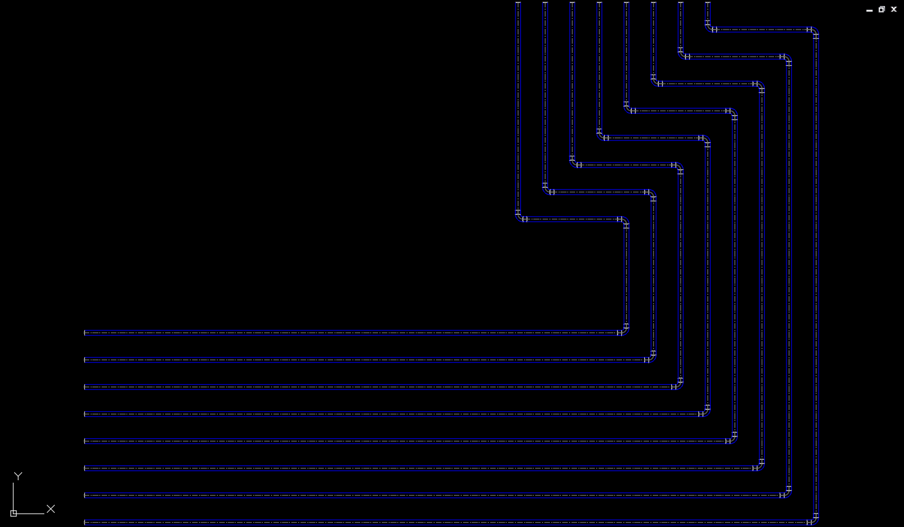

As you can see in the image above, all of the lines shown share a common color. This is because they were all drawn on the Cold Water service and all of the objects are currently set to ByLayer in their color property.

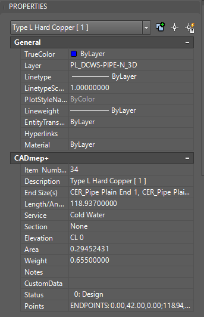

In the Fab Viewer, you will see the exact same thing if the Colour By option is set to Service.

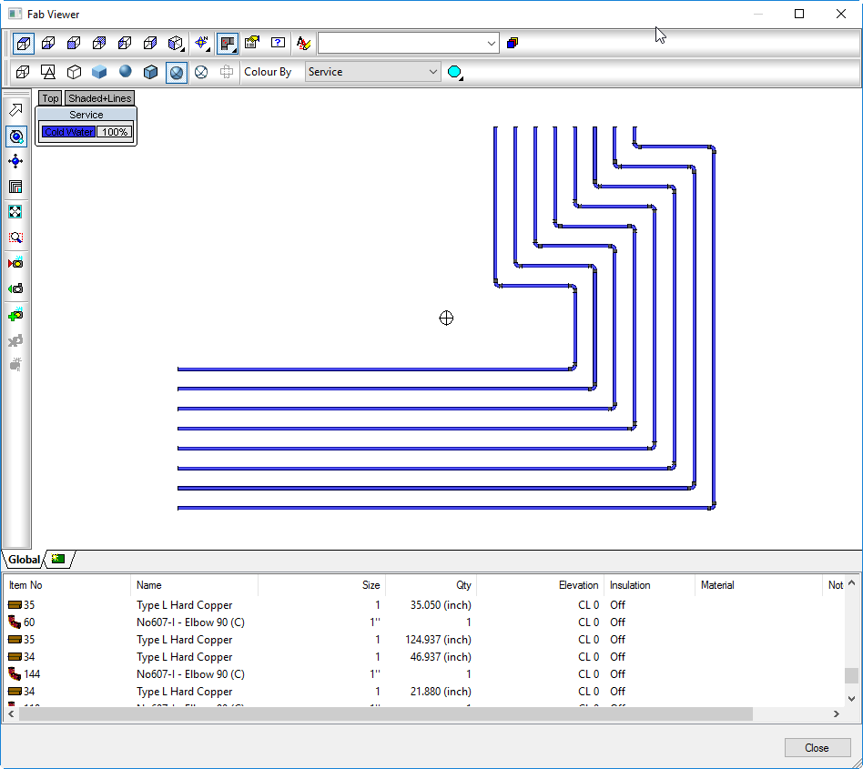

One option inside the Fab Viewer is to view content with color applied by Status. These colors are derived from the Main Database and can be set and modified by your database administrator.

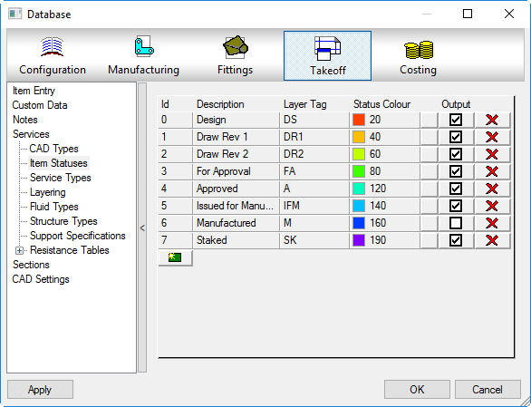
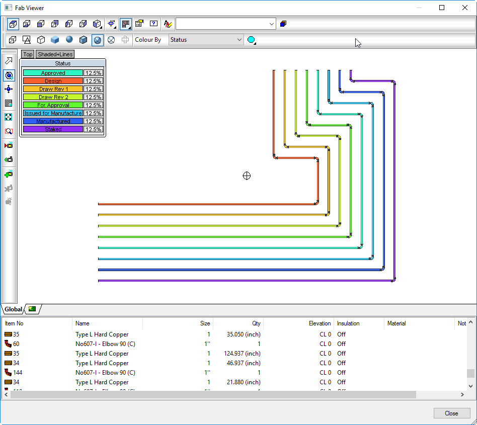

Unfortunately, this is not a tool that is available directly in the model. This is Fab Viewer only functionality. Luckily for us, Status is one piece of information available through VLA properties. <em>If you have not yet read Josh's post on [VLA properties], I would highly recommend heading there now.</em>

With this one bit of information, it is easy for us to simply iterate through the model, check each object's status property, and set its color based on the status list that we provide. Let's look at the code.

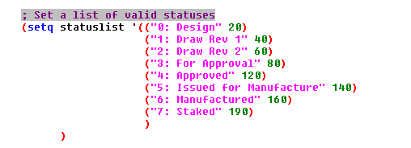

Here, we create a list of statuses and include the color index that we want to show for each status. As stated previously, these are derived from the Imperial Content V3.04 database (see Main Database screenshot above). For simplicity sake, I have removed the spaces from the beginning and end of the status names. This allows us to use vl-string-trim to check an object's status against our list without the need to track the exact number of spaces that are prefixed on the properties string value (i.e. "0: Design" vs "     0: Design").
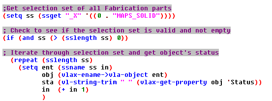

Next, we will check the object's status against the list of statuses that we have provided, and set the color from the list if found. If the status is not found in our list, we will add the entity to a selection set that we can isolate after the function has finished executing, and add the name of the status to a list, which will be displayed at the end of the routine.
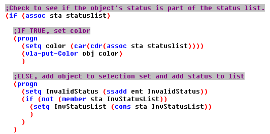

If everything goes well, all objects with valid statuses will be colored appropriately in the model.
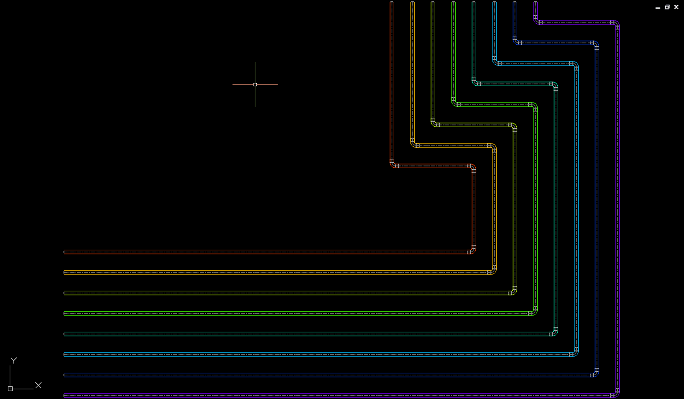

Below, I have created a new status in the database and set some of the objects to the new status. Since this status does not exist in our list, the routine will show an alert message notifying you of this and listing the Invalid Statuses that were found.
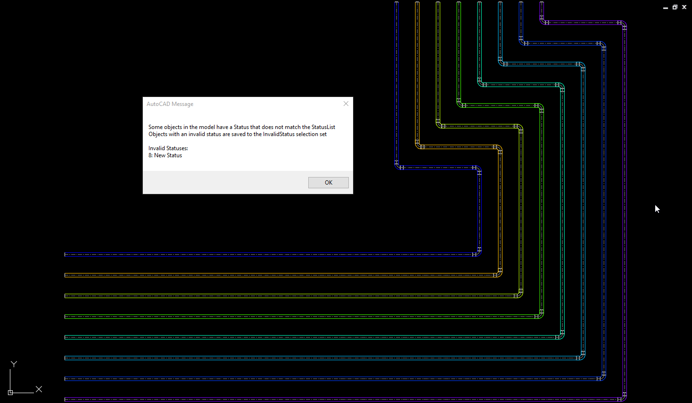

The objects are also added to the named selection set InvalidStatus, so that you can work with those objects after the routine is finished. Simply issue any command that works with a selection set, such as SELECT or MASKVIEW and enter !InvalidStatus when prompted for the selection.
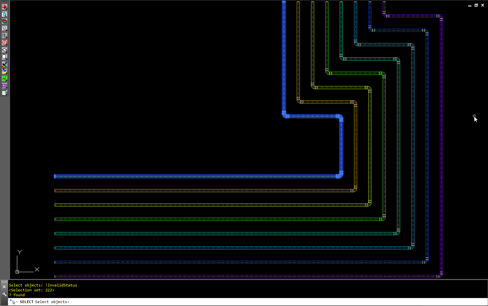

In the lisp linked below, I have also included the HOB_GetAllStatuses command function which will print a list of all model statuses to the command line. These can be copied and pasted for use in the StatusList or for any other purpose you might find for it.

I will be following this post up with other "ColorBy" functions that we have found useful, and as always, we welcome any input or suggestions.

Also, make sure to check back regularly for updated content. We have a ton of new tools in the works, and a few new toys to play with. We'll continue to share our knowledge and experiences, so make sure you're checking back regularly. Or, make life easy and follow the blog. We don't share your information and have yet to actually send any emails out aside from new post notifications.

Happy Belated St.Patty's day! Cheers!

[HOB_ColorByStatus.lsp](/assets/lsp/HOB_ColorByStatus.lsp)