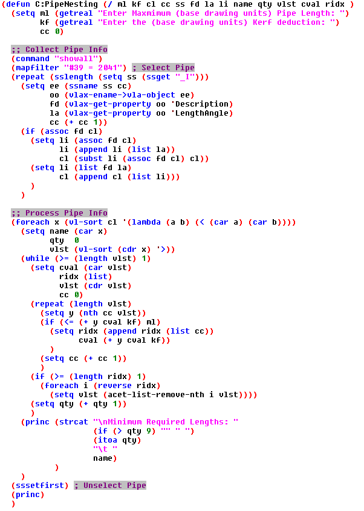
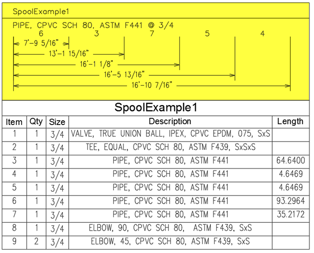
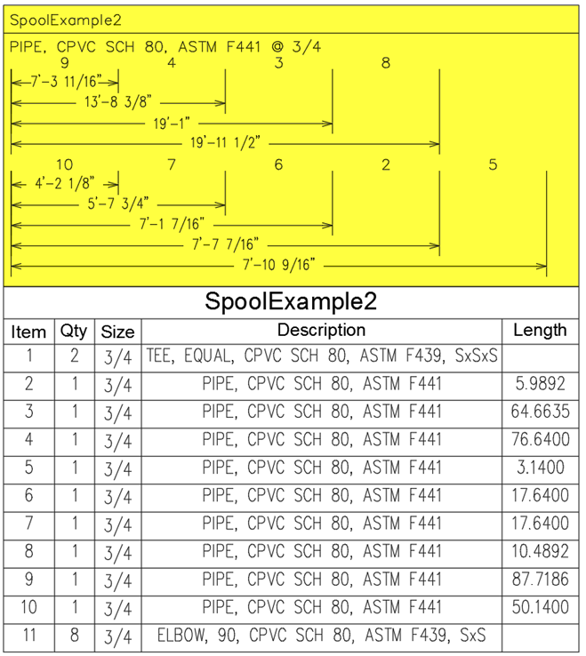

The CADmep software has had linear nesting for as long as I've been using it. Linear Nesting is a process of grouping the right parts together to minimize material waste. However, the nature of the standard implementation for pipe trades is all about generating a separate printable report and I'd much rather have that information directly on my spool drawings.

My own personal implementation of this will automatically generate visual representations of baseline dimensions to be placed directly on my spools, but the provided lisp only gets you as far as outputting the minimum number of lengths needed to accommodate your piping model. More often than not you can just run a 2041 based report and divide the total length by 10, 20 or 21 feet (depending on your material type), round up to the nearest full length and that would typically order the correct amount pipe. However, I have seen many unique projects where large quantities of long, but not full lengths were used and in those scenarios simple division would leave you with material deficits; which is the other great reason Linear Nesting is important.

With that said, Fabrication already has nesting reports and this post may "seem" useless to some of you, but some of us actually need that same functionality available from a programming aspect… For those individuals I hope this post will get you pointed in the right direction on your own endeavors. Here is the code, but read on for a breakdown of what it does and some ideas of how you might want to use it.

## The Code:
 [Click to download](/assets/lsp/HOB_Pipe_Nesting.LSP)
 Update: added a [Plant 3D version](/assets/lsp/HOB_Pipe_Nesting_for_P3D.LSP)

## What it does:
First we make lists of length values for a given Pipe Name and Size. Next it sorts those lengths in descending order so that it will sequentially use the longest pipe length first; which represents our highest probability of waste when it's not a full stick. Now that it has a non-full stick, it then goes through the remaining lengths attempting to stay <= your specified maximum pipe length plus any kerf requirements; ie 120 if cast iron or 240 if stainless steel. All the while removing the smaller pieces it was able to consume as filler when trying to hit your maximum length. In this example it is just doing +1 to quantity and will output that total to the command line as it goes through processing the various lists of Pipe at a given Size.

A Kerf is literally defined as the amount of material consumed by the act of cutting. However, in the piping trades many of our materials have almost zero loss during cutting, but still obtain loss through an additional process. If we are talking about high purity stainless tubing, then we will lose some material when facing the tube and I might provide it 0.125 to account for this during the cutting process. If we are talking about a PVDF, then there will be melt loss at the time of welding not cutting and I would probably want to give it a 0.1875 to account for this during cutting. However, if I was cutting copper tube with a chop saw and the chop saw had a blade thickness of ¼", then I would provide this routine a 0.25 to account for the actual material loss at the time of cutting. All of these situations can be accounted for by providing the proper Kerf value that represents the loss of all your cutting and assembly processes. You will just have to figure out what your scenario needs.

Kind of cool, but in my industry we do a lot of high purity bent tubing. We model bends as a separate (elbow) object and the length/angle VLA property used here would represent those bends as an angle instead of a length. So, in that situation this example would be useless to get my minimum required pipe lengths. I will overcome this problem, but haven't had time to dig into it and this ultimately represents a very small portion of my long term plan for programmatic nesting. I am pretty sure my bent tubing implementation will be using progressive bending formulas and will be more valuable for bend layout than making actual cuts.

## Initial Plan:
Like I said, that code doesn't do much you can't already do. However, foundationally it could be easily modified to create the nested groups that best minimize waste and generate visuals to streamline the cutting process. With some modifications, you could easily give the fab shop a sequenced list of pipes to go cut by hand or even feed the information into automatic pipe cutting machines. Below are a couple examples of automatically generated layouts that I am now ready to start shipping right on my spool drawings. It could be used to generate larger scale layouts to efficiently cut and label all the pipe lengths for any number of spools that can then be kitted with the BOM fittings for hand off to assembly crews. 
Of course, all of this requires your database to be spot on…. So, if you haven't properly invested in and QC'd your Database then this is probably the worst possible thing you could try to do; ***you've been warned….***

In these examples I used 240 and 0 Kerf. The yellow area was automatically generated by my personal implementation:

## Closing Remarks:
I think there is some great potential in this concept to increase productivity and profitability. Enough that I expect my final implementations of this will have some major effects on us making competitive bids that win more projects. However, I am from the high purity world and we have to do just about everything inside clean rooms; which does present a ton of logistical problems. To the degree that we may have to build the programmable pipe cutting/facing/labeling tools ourselves. If anybody out there knows of a programmable stainless tubing cutter that doesn't send particulates into the air, *please tell me about it*.
