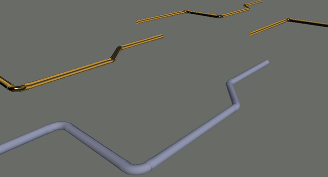

At AU 2016 I sat down with a number of Autodesk development types for a focus session on what we want as customers. One of my personal desires was an easy way of creating presentation material from existing projects. I wanted an <em>easy button</em> to make those past projects of specific types pay off on similar projects we are bidding with new potential clients. In this post I will share one of the band aids I came up with to fill that void. We will be using the archaic Dialog Control Language (DCL) to pair up Service names with available materials and then apply those materials directly to objects referencing your selected Services. I will probably be referencing Fabrication substantially more than Plant 3D, but that's just because I wrote it for CADmep and added Plant 3D functionality in less than 10 minutes. Honestly, I could make this work with AutoCAD MEP in about 5 minutes if I wanted to; its just using any VLA property as reference criteria and the AutoCAD Material property that is native to *all* graphical objects....

# Implementation Limitations
The provided example is something of a blind application, if you have an insulated service then the insulation will also take on the specified material. If you want to style your pipe independent of your Insulation, then you will have to apply the materials directly to the appropriate layers instead. Then if you further wanted your No-Hub couplings to look more metallic than Cast Iron, you would then want to apply a metal material directly to the Coupling objects. Hopefully you see there is a lot to consider here and that this trick only represents a small part of producing a high quality presentable output for a client. My own implementation will handle all of these scenarios, but what I provide here should get you pointed in the right direction.

# Autodesk Material Library
As far as I can tell, Autodesk seems to have made (programmatically) automating the import of an existing/specific Autodesk Material down right impossible. I found a work around that feels somewhat polished through my implementation and I will detail what I am doing here, but I do consider it rather ugly. While doing my research on this, I saw a consistent theme that every aspect of standard AutoCAD interfaces regarding the application of materials was rather clunky; especially when applying them to layers… Furthermore, I found that AutoCAD itself does an exceptionally poor job of representing what the applied materials will actually look like once evaluated by Navisworks; which was also super disappointing. The Autodesk Material Library itself is pretty nice and has a lot to offer us, but it certainly needs better interfaces. My DCL is pretty cruddy too, but I'll probably be making a .Net version of this at some point.

# The Code
I am going to break this up a bit and discuss different portions of it, but ~~all of the images showing code do have the same hyperlink for downloading~~ you can [download the code](/assets/lsp/HOB_VLA_Material_Mapping.zip) and a sample dwg. Lets look at the Command Defun section first. From there, we will go over the various supporting functions called within it.

```lisp
(defun C:HOBMaterialMapper (/ ss cc path ee oo sn itm lst sls wls materials dclDialog)
  (setq ss (ssget "_X")
	cc 0
	path (HOB_Create_Dialog))


  (repeat (sslength ss)
    (setq ee (ssname ss cc)
	  oo (vlax-ename->vla-object ee)
	  cc (+ cc 1))
    (cond
      ((vlax-property-available-p oo 'ServiceName)	;Fabrication
       (setq sn (vlax-get-property oo 'ServiceName)))
      ((vlax-property-available-p oo 'Service)		;Plant 3D
       (setq sn (vl-catch-all-apply 'vlax-get-property (list oo "Service"))))
      )
    (if (and (= (type sn) 'STR) (/= sn ""))
      (if (assoc sn lst)
	(setq itm (assoc sn lst)
	      itm (append itm (list ee))
	      lst (subst itm (assoc sn lst) lst))
	(setq itm (list sn ee)
	      sls (append sls (list sn))
	      lst (append lst (list itm)))
	)
      )
    )
  (setq materials (HOB_GetMaterials nil)
	dclDialog (load_dialog path))  
  
  (HOB_ShowDialog)  
  
  (if (findfile path) (vl-file-delete path))
  (princ)
  )
```

There really isn't that much going on within the command. It should become clear as we go that I made a choice to offload most of the actual work to various helper functions. Note that the Plant 3D Service property threw automation errors on some objects and had to be error trapped; I was just using the sample project and it could be just a bad model.

First we find all objects containing either the Service (P3D) or ServiceName (CADmep) property with SSGET and and some checking to see if properties exist. Next we dynamically create a DCL file for users to interface with. Note that I am not going to show the code for creating the dialog, but it is in the download. Also note that my version will require you to have enough computer rights to create temporary files in:

C\Users\%USERNAME%\App Data\Local\Temp\

After that we analyze our Fabrication objects and create 2 lists. One of them is for populating the DCL and the other is for doing the requested work on qualifying objects. The first is a dumb list of unique service names. The second pairs the service names with all of the Entity Name's referencing that service.

Next we generate a list of materials in a very similar way that we are populating sls list; more on that in a minute. Load the DCL and upon it closing it will trigger the HOB_Apply function that actually does the work of assigning material names directly to objects per your specifications. Finally and just before we exit, we then attempt to clean up our temporary file; nobody likes trash.

```lisp
(defun HOB_GetMaterials (DoImport / ret pth)
  (if DoImport
    (if (setq pth (getfiled "Select a Material DWG" "" "dwg" 0))
      (vla-delete(vla-insertblock(vla-get-modelspace(vla-get-activedocument(vlax-get-acad-object)))
		   (vlax-3d-point (list 0 0 0)) pth 1.0 1.0 1.0 0.0))))
  (vlax-for x (vla-get-materials(vla-get-activedocument(vlax-get-acad-object)))
    (setq ret (append ret (list (vla-get-name x)))))
  ret
  )
```

The HOB_GetMaterials function is actually pulling double duty, this is because it is also responsible (through Boolean flag) for prompting the user for a dwg that is pre-loaded with materials. In my dialog, I have a button keyed to import materials and it calls this function with T to make the user specify a file and then reloads the DCL lists. It is kind of ugly that we have to keep a geometry free dwg with pre-loaded materials in it to make this all work, but I do call the VLA-DELETE on the inserted block immediately after; which means everything it brought in and you didn't use could be immediately purged out. There is a small material dwg in the download link with a few (slightly modified) Autodesk Materials in it to play with. If you want to start building your own pre-loaded standard materials dwg, then use the MATLIB command and import as many as you like/save the drawing where you can find it.

```lisp
(defun HOB_ShowDialog ()
  (if (not (new_dialog "HOBmats" dclDialog)) (exit))
  (HOB_LoadLists)
  (action_tile "Reset" "(HOB_Reset)")
  (action_tile "Import" "(setq materials (HOB_GetMaterials t))(HOB_LoadLists)")
  (action_tile "Remove" "(HOB_Remove)")
  (action_tile "Add" "(HOB_Add)")
  (action_tile "accept" "(HOB_Apply)")  
  (start_dialog)
  (unload_dialog dclDialog)
  )
```

Again we see that I opted to keep this a purpose a driven defun. You see all the normal stuff you would see in numerous other DCL examples, but I have opted to offload populating the List Boxes into a separate defun; this is because I will be doing it a lot inside this dialog. We'll look at some of the other defuns later, but the oddball (import) is what we discussed a moment ago.

```lisp
(defun HOB_LoadLists (/ cs cm)
  (setq cs (if (get_tile "slst") (get_tile "slst") "0")
	cm (if (get_tile "mlst") (get_tile "mlst") "0"))
  (start_list "slst") (mapcar 'add_list sls) (end_list) 
  (start_list "mlst") (mapcar 'add_list materials) (end_list) 
  (if (>= (length wls) 1)
    (progn
      (start_list "wlst") (mapcar '(lambda (x) (add_list(strcat (car x) "¥" (cadr x)))) wls) (end_list))
    (progn
      (start_list "wlst") (end_list))    
    )
  (set_tile "slst" cs)
  (set_tile "mlst" cm)
  )
```

This is all pretty standard stuff for populating a DCL list box, but I will point one thing out as a recommendation for anyone creating DCL's that have to reload information. Notice the first thing I am doing is collecting the currently selected indexes prior to reloading any lists and if nothing is selected then I am forcing a value of zero to be used at the end of this defun. All this does is keep the user from getting annoyed with previously selected items no longer being selected. Its all about maintaining consistency and it is little things like this that matter the most, but can never be appreciated by the end users unless you made them suffer with unrefined alpha versions first.

# Interface
We will dig back into some more functions that the HOB_ShowDialog defun is referencing in a moment, but first we should really see what this thing actually does. Check out the animated GIF below; just bought <a href="https://www.techsmith.com/camtasia.html" target="_blank" rel="noopener noreferrer">Techsmith Camtasia</a>. I have done a lot of video editing (decades ago), but it was such a pain I wasn't looking forward to ever providing any videos for this blog. It is safe to say that industry has come a long ways, but I specifically forked out the $200 for a TechSmith product because I knew it would be as close to stupid simple as possible and just plain work; highly recommend!


Simple enough really. You select from Fabrication Services currently in your drawing and a material that is also within your current drawing, then you just add them to the processing list. Couldn't resist using HOB's favorite delimiter (¥) for this example; <em>its all about the yen baby!</em> You can remove services if you change your mind. When your all set, just hit okay and anything in the Processing Queue will have materials applied to it. This also demonstrates the HOB_Import defun's secondary nature for importing materials from a specified dwg.

# More Code
The reset button in the top left is a master restore. All objects containing a Service or ServiceName property will be reset to the standard “ByLayer” material type. As shown in this HOB_Reset defun:

```lisp
(defun HOB_Reset ()
  (done_dialog)  
  (foreach x lst
    (foreach y (cdr x)
      (vla-put-material (vlax-ename->vla-object y) "ByLayer")))
  )
```

Here we kill the dialog and just go through each of our LST objects casting it into a VLA Object and revert its Material property to the AutoCAD default value.

```lisp
(defun HOB_Remove (/ v)
  (if (get_tile "wlst")
    (foreach x (reverse(read (strcat "(" (get_tile "wlst") ")")))
      (setq wls (acet-list-remove-nth x wls))))
  (HOB_LoadLists)
  )
```

In the HOB_Remove we are reversing the list to make sure we are removing indexes from the back of the list first. If we didn't and we removed index 1 then what used to be index 5 would become index 4, then we would be removing the wrong items if we originally had 5 selected for removal as well.

```lisp
(defun HOB_Add (/ mat ser)
  (setq mat (nth (atoi (get_tile "mlst")) materials))
  (foreach x (read (strcat "(" (get_tile "slst") ")"))
    (setq ser (nth x sls))
    (if (null(assoc ser wls))
      (setq wls (append wls (list (list ser mat)))))
    )
  (HOB_LoadLists)
  )
```

The add is also fairly cut and dry, but we do have to process multiple service selections. The theme you should be noticing is that when we change our list we then must reload our lists; IE the call to HOB_LoadLists.

```lisp
(defun HOB_Apply ()
  (done_dialog)
  (foreach x wls
    (foreach y lst
      (if (= (car y) (car x))
	(foreach z (cdr y)
	  (vla-put-material (vlax-ename->vla-object z) (nth 1 x)))
	)
      )
    )  
  (princ)
  )
  ```

The defun doing work actually isn't that impressive. We kill the dialog, iterate through the paired Services and Materials, find the equivalent in our Service/ENAME list and just force feed the specified material (nth 1 x) onto the all of the objects.

# The Results
This is a fairly trivial example of what you could do using this as a starting point. I know I plan on doing quite a bit more development so my pipe looks like Carbon Steel and my Insulation looks like PVC Jacketing. I probably will take it to the level of making the routine detect/lookup the last used configuration on a given model, maybe read from an INI that I specifically setup by project or possibly save/restore filter presets; oh yes, there will be wildcard searches! I am still playing around with all these concepts and if you too want to have great looking, easily presentable models for potential clients, then I would suggest you do the same. Let me know if you have any questions about this and I'll see if I can help you out with them.



[Download the Code](/assets/lsp/HOB_VLA_Material_Mapping.zip)
