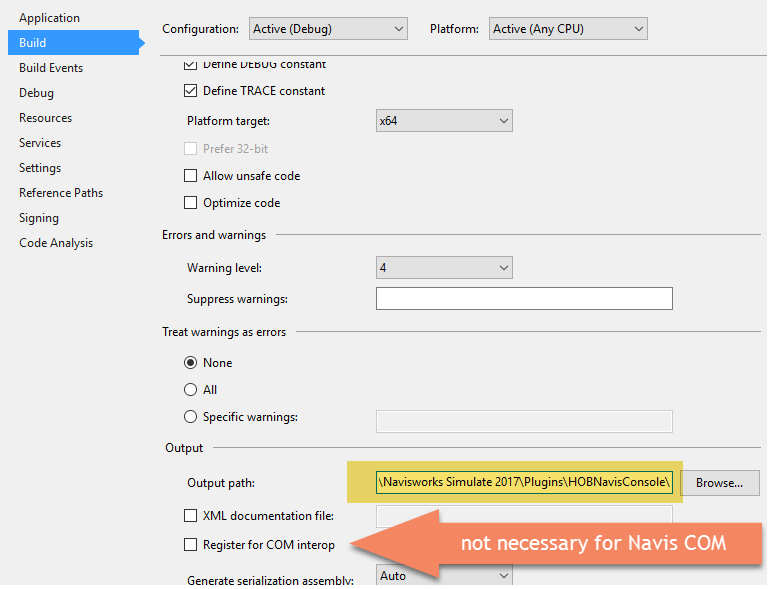
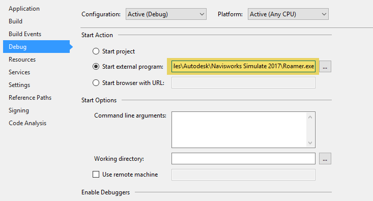

I was about to make a post involving a (somewhat) novelty Navisworks plugin and went looking for someone else's rendition of manually installing a Navisworks Plugin and wasn't real pleased with what I found. So, here I am posting for the sake of having something to reference….. However, to make this meaningful, I am going to expand on this topic a little bit by also providing some coverage of setting up Visual Studio to debug a Navisworks Plugin.

#### Eclectic Navisworks Plugin Thoughts
- You can use .Net
- You can use COM
- You can mix COM and .Net together leveraging both without obvious ramifications
- Navisworks plugins should derive from one of the predefined “Plugin” classes Autodesk gave us
	- There is actually quite a bit diversity and I don't consider the entry points they've given us to be limiting; you just have to know what's available and when to use what.
	- I've made always on/non initiated plugins using the EventWatcher type
- You can have multiple plugin types defined in a single Visual Studio solution
- The DLL and the containing folder names must match exactly
	- This is not case sensitive
	- Navisworks will not load the plugin DLL if the folder doesn't match the DLL name
        - *Correction*: If you are referencing any support DLL's in your project, then these DLL's must be stored in the Navisworks Dependencies folder in order to be found and loaded at runtime.
- Navisworks is actually one of the most stable software's I've seen, but an improper PlugIn build can destabilize the primary thread causing fatal errors
- Navisworks Plugins are only intended to run in Simulate and Manage product versions
- All PlugIn's must be in the ..\Navisworks 20xx\Plugins\ folder
- Untested, but <u>I am told</u> that Navisworks plugins are extremely version specific. I have the hardest time understanding why this would be the case since the references don't change names, are set to non-version dependent within VS and they mostly just adding on to the existing API.
	- If you download a 2017 plugin, then you better be trying to load it on 2017
	- Note I will come back and update this if my 2017 version works on 2018. Waiting on Autodesk to issue me my ADN license of 2018 simulate.

#### Installing a Plugin
Let's say that you download an HOBplugin.dll file from our site that is intended to work with (your version) of Navisworks. You would need to:

- Locate your Navisworks Installation directory.
	- Typically in C:\Program Files\Autodesk\Navisworks Simulate 20##\
- If a Plugins folder does not exist in the above path, then you need to create it.
- Create a folder inside the plugins folder called “HOBplugin”
	- C:\Program Files\Autodesk\Navisworks Simulate 20##\Plugins\HOBplugin\
- Paste the supplied DLL into that HOBPlugin folder.

Fairly simple, only a matching Folder/DLL name pair within the Navisworks plugins folder can load into Navisworks when it starts up. If there are any name deviations, build errors/bugs or possible version dependencies then it could either be ignored, fail to load or completely destabilize Navisworks; depends on what the plugin is attempting to do.

#### Visual Studio References
If you are setting up a Visual Studio project for the purpose of extending Navisworks, then you will want to (potentially) attach the following references to your project. Also note that if you are building a new project from scratch, then your project type will be of the CLASS LIBRARY (DLL) variety; the most generic version you can find. If it says things like windows 8.1 then your probably not selecting the correct one.

Other than that there are just a hand full of DLL's you could potentially use within a Navisworks plugin. Disclaimer, I could have missed something and references are exactly that, you can expand the functionality of any project with any number of various references you wanted.

- Autodesk.Navisworks.Api.dll
- Autodesk.Navisworks.ComApi.dll
- Autodesk.Navisworks.Interop.ComApi.dll
- Autodesk.Navisworks.Interop.ComApiAutomation.dll

I do not presume to know a ton about any of these, but I can tell you that the first reference is the officially supported API reference for Navisworks. There are things within the COM API's that can ONLY be done through COM, but I feel like those scenarios are getting to be less all the time and there is absolutely things in the first namespace that were developed after COM was abandoned thought too. My stance on the matter: go with COM only if you absolutely must, but otherwise avoid it if you can. The Navisworks API is largely nonsensical at times, but the COM portion is absolutely an endless game of poking/prodding at illogical undocumented namespaces for a potential reward. That doesn't mean the .Net portion is all nice and logical, but it is by far less of a magic number system.

#### Visual Studio Project Setup
I will be deferring all the concepts of Navisworks Plugin types to other posts/sites; I'm a fan of [Spiderinnet](http://spiderinnet.typepad.com/). However, there are some fundamental project settings we need to cover to make your project run/debug seamlessly. In the drop down menus (at the top of your window) find the Project menu group. Then go to the last option *YourProjectName Properties* and find the *build* area. It should look something like this:

In the build area, the most important thing you need to do is designate your DLL plugin to output directly to the Navisworks Plugins folder as specified above. So, go make a folder in the Navis\Plugins\ folder identically named to your project solution and then target it as the “output path” directory. Also note that the Navisworks COM API's do not require registering for COM interop. This option is a topic beyond the scope of this post.

After you've told Visual Studio to build your DLL into a path that Navisworks can actually see, then we need to setup the Debugger to attach on the external process; Roamer.EXE.

This is pretty common with all Autodesk products. In AutoCAD you would be targeting Acad.EXE and probably providing some command line arguments of the stock/vanilla or Vertical product. Here we are doing the same thing, but just targeting the appropriate roamer.exe file. Note that Freedom, Simulate and Manage all have the same executable name, but Freedom apparently cannot run plugins; which I'd like to verify personally someday.

Well, if you have any questions, concerns or corrections to anything I've covered here, let me know…
