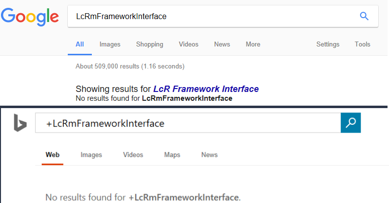

As I told you guys a while ago, I had a personal goal to put a keyboard shortcut interface back into Navisworks. That command line project isn't quite done yet, but I wanted to share the backbone of the system. To make my project viable, I had figured out what the ExecuteCommand method actually did. Unfortunately, there wasn't any documentation of any kind. Which left me an obligation to put some out there; it's pretty EPIC!

I am really not kidding, this is very obscure stuff here. I've looked everywhere I can think of and there isn't a single google hit for the “LcRmFrameworkInterface” namespace which owns the ExecuteCommand method. The official documentation doesn't mention it anywhere either, but it does have references to ExecuteCommand in the context of the user CommandHandlerPlugin namespace; which would never lead you down the path I'm about to.

<a href="/assets/img/052117_0037_lcrmframeworkinterface.png"></a>

## Command ID's
If you've ever tried to customize RoamerCommands.xml then you know why I wanted to bypass it and make an entirely new method for initiating Navisworks Commands. Here is a basic example of what you would find in there, but picture 1800+ lines like that ands its just a mess.

> EDIT 10/22/2017: I found the mother load of commands in this collection = Autodesk.Navisworks.Gui.Command.CommandManager.Commands  
> You will have to add references to Navisworks.Gui.Interface & Navisworks.Gui.Generic to utilize this collection.

```xml
<Command ID="RoamerGUI_OM_MODE_WALK">
   <Icon>navmode-walk.ico</Icon>
   <Shortcut>Ctrl+2</Shortcut>
   <Toggle>true</Toggle>
   <Accelerator>W</Accelerator>
</Command>
```

In that code, we see that holding the CTRL key and pressing the 2 key will initiate the walk mode. Which is great, but a long time ago I said, okay…. Why am I hitting CTRL key at all? Lets just set this to <Shortcut>W</Shortcut> and be done with it. Well, that had ramifications anytime you want to actually type inside Navisworks; it is always listening! You could be trying to name a saved viewpoint and boom it sees a W, closes your naming field and starts the walk tool; very annoying…

However, the most important part of what we see in that code block is “RoamerGUI_OM_MODE_WALK”. The act of pressing CTRL+2 does start the walk tool, but it does this by sending that specified Command ID value into the LcRmFrameworkInterface.ExecuteCommand method. Navisworks is actually loaded with hundreds of GUI Command ID strings, but until recently I didn't realize they meant anything at all to me; I just figured they were part of the biggest internal SelectCase/Switch statement ever. Other than the RoamerCommands.xml, I assume there is zero documentation for all the various command definitions that Navisworks can actually function with. So, lets hope that this xml is largely dynamically generated directly from the UI elements referencing them upon every release. If not then we are largely dependent on the Dev team to disclose them to us through RoamerCommands. I will probably go try to collect them all from the UI elements myself and compare them against the XML someday, but for now I feel like I have a lot to explore.

## Syntax
I don't think this could be any easier. You don't have to create any special objects, but you do have to know where to look. Here is the important namespace:

`Autodesk.Navisworks.Api.Interop.LcRmFrameworkInterface`

Note: There are some other interesting things in the LcRmFrameworkInterface namespace I still plan to explore. Maybe I will do some future posts on other items hiding in there later.

Here is the function syntax:

`ExecuteCommand(string, Autodesk.Navisworks.Api.Interop.LcUCIPExecutionContext)`

All we have to do is put “RoamerGUI_OM_MODE_WALK” in as the string argument and from what I can tell you can pick any of the LcUCIPExecutionContext enumerators you want.

## LcUCIPExecutionContext
I usually just give it the eTOOLBAR value; which is 16. In truth, I don't know much about what this actually does and have yet to encounter a scenario that altered my results, but I think we can glean enough to know it could have an effect. Here is the list of possible enumerators:

    eACCELERATOR = 32
    eAUTOCAM = 2048
    eBROWSERBAR = 256
    eBROWSERMENU = 512
    eCOMMANDLINE = 1
    eCONTEXTMENU = 128
    eDIALOG = 4
    eMARKINGMENU = 4096
    eMENU = 8
    ePANEL = 64
    eQUICKACCESSPANEL = 8192
    eRIBBON = 1024
    eSCRIPT = 2
    eTOOLBAR = 16
    eUNKNOWN = 0

It is pretty obvious to me that the ExecuteCommand wants to know exactly what told it to do work. What I don't know is if any particular context actually yields a different results or if it is just purely a micromanagement system. There are some interesting ones in there I have some hope for. Fine examples would be eSCRIPT & eCOMMANDLINE. I am hoping I can someday discover a context of combining a Command ID with a value designation. A notable example would be setting the “RoamerGUI_FOV=45” or something like that. The DLL example at the bottom of this does give you the ability to manually plug values, while using whatever context setting you want directly into the ExecuteCommand method… Should you want to try your hand at figuring out the <u>possible</u> extended syntax too….

<u>Note</u>: you should use the fully qualified namespace (or some version of a using/imports statement), but in the examples <u>below</u> I will simply reference the value of 16 to denote the eTOOLBAR context.

## Examples
Here I will show you a couple of interesting ways you could use this, but note that the 2017 RoamerCommands.xml has 475 unique Command ID's you could <u>potentially</u> leverage to your advantage; I suspect many of these will be significantly smaller footprints for the way experienced Navisworks developers currently accomplish some things. The provided C# project download (not the DLL download) has a complete list of Command ID's that exist in the RoamerCommands.xml file. Just note that it is reading <u>YOUR</u> RoamerCommands.xml and if you've modified it in any way, then what you see in the Dock Panel may not be complete.

This would toggle on/off the Selection Tree dock panel:  
`ExecuteCommand(“RoamerGUI_OM_VIEW_TREE”, 16)`

This will bring up the transparency override dialog for the current selection (requires pre-selection):  
`ExecuteCommand(“RoamerGUI_EDIT_OVERRIDE_TRANSPARENCY”, 16)`

This would initiate the measure tool with the shortest distance between 2 objects (requires pre-selection):  
`ExecuteCommand(“RoamerGUI_MEASURE_SHORTESTDIST”, 16)`

This could be used for toggling sectioning on/off:  
`ExecuteCommand(“RoamerGUI_OM_SECTION_MASTER_ENABLE”, 16)`

You can use this next one to alphabetically sort all your viewpoints. This has apparently been in the interface for a long time, but I never noticed it until I created this project:  
`ExecuteCommand(“RoamerGUI_OM_VP_SORT”, 16)`

This will set your selection resolution to By Layer:  
`ExecuteScript(“RoamerGUI_SET_SELECTION_RESOLUTION_LAYER”, 16)`

I think by now you get the drift. There are a ton of things that the ExecuteCommand can do for us (primarily from the interface perspective) that may be otherwise difficult (or impossible) to perform in other ways with the Navisworks API. Lets move on to the code/plugin take away.

## Sample Project: HOB Command Dock Panel
First of all, I would like to point out that this is also an example of using utilizing an ElementHost to inject WPF within your Navisworks Plugins. Aside from that, the intent of this is to give you an interface to play with the various Command ID's defined inside the RoamerCommands.xml file. Review the animated give to look at the interface and show a couple of usage examples:

<a href="/assets/img/052117_0037_naviscommandiddoc.gif"></a>

This plugin is presented as a utility for developers to potentially find & test Command ID's they may want to utilize. This is not intended to substantially extend the usability of Navisworks and everything it can do is already available through the interface in one way or another. Furthermore, it is important to note that many functions will throw an error. In those scenarios, there are either circumstances that have not been met (like having selected objects) or the Command ID directly represents a control that isn't necessarily translated without a specific value input.

This is exactly why I so badly want to find some way to provide that secondary value directly to the ExecuteCommand method. Note that I made the field where it loads a command for execution entirely open for arbitrary input; feel free to plug random values in it. If anyone out there figures out a syntax for providing additional values to a Command ID, then please let me know!

## Links
Need to know how to manually install a Navisworks Plugin? See my post about it:
[Side Loading/Manually Installing a Navisworks Plugin]

This link contains both 2017 & 2018 Plugin DLL's.  
[DLL Download](/assets/dotnet/HOB_ExecuteCommand_Plugins.zip)

This link downloads the C# project solution & code so you to build your own for whichever version you want.  
[Code Download](/assets/dotnet/HOBNavisCommandDoc.zip)

## Final Remarks
The only Navisworks API reference used in this application was:  
Autodesk.Navisworks.Api.dll

However, you will also need to reference the Microsoft assembly that makes the ElementHost function:  
WindowsFormsIntegration.dll

There are some other XML files containing additional specialized command ID's, but I haven't explored them and I leave them for your own exploration.

The provided code may contain some stuff that doesn't entirely make complete sense. I stole a few functions from my Navisworks Console project that hasn't been released yet. I did make an attempt to scrub the obvious stuff out, but I suspect I could have missed something.
