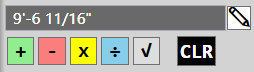
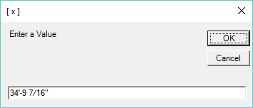
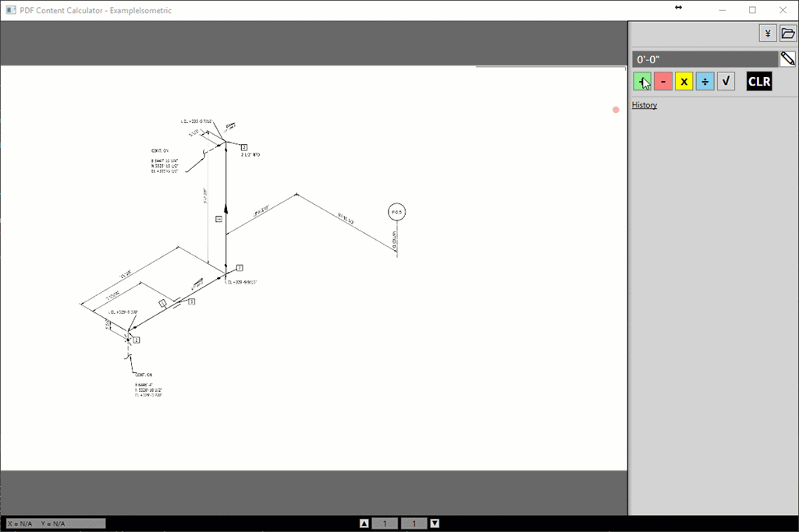

This post isn't actually BIM software related, but it is something all of us BIM people have to deal with on a regular basis. In this post I will be doing a product review on XFinium PDF toolkit, providing a working example of how to work with their demo version and talking about the Engineer/Designer roles in the construction industry.

Generally speaking, there is a dividing line between an engineer and a **constructability** designer. Yes, there are many people that can successfully wear both hats, but those people are rare and I think many companies have finally figured that out. At least, I am personally aware of several engineering outfits that have rooms full of designers with construction backgrounds now and there was a time where I didn't see hardly any of that; exception being the guys with both hats. The other big problem, people have largely dismissed the value of good designers and that is true even within the construction companies. Example, I had an extremely bad situation dumped on me and virtually everyone hated me by association before I ever stepped foot on site. I spent 2 months attempting to persevere through the scopes already in motion from the prior regime, then I finally got my chance to start an area **my way**. I wish I was kidding, but everyone complained about my design and generally just looked at me like I was out of my mind everywhere I went. However, when they went to install it, they completed the tool hookup in truly record time with almost no field rework of prefabrication and then they all went back to polishing the prior regimes garbage again. The icing on the cake though… My biggest opponent of what I had done came back and asked me to do everything that way moving forward.

Over the years I think all of us on the construction design side have come across a project that the engineering firm told us was LOD 9,000,000 and that all we had to do was just go build it. In my experience, more often than not the model they claimed to be LOD whatever, didn't actually work and we wound up collecting a large change order to essentially go redraw everything in constructible ways. This mentality that the engineering, design, coordination and fabrication drawing production all belongs to a single firm has been going on for a long time, but generally not as successful as people are lead to believe. However,  I have heard many stories from peers where the occasional one of these actually went according to plan, but until recently I've drawn the short straw and watched every single one of them turn ugly. Why? Well there are many reasons, but a good high level observation would be that commercial and semiconductor engineers don't understand pipe without fully coordinated supports is non-constructible and may not work where they allocated space for it. On the biopharm side, the engineers seem better about supports, but frequently don't understand a minimum requirement of a truly accurate BIM fitting database and meticulously drawn slope or else the end product usually winds up theory instead of constructible.Unfortunately, fixing bad slope always winds up a compounding error in “coordinated” models and is often very costly to fix! At least those are the big picture problem areas I've observed, but the true depth is far beyond that of course….

The industry has been slowly migrating towards a philosophy where the GC, CM and engineering firms want to do everything under their own roof. Being on the construction design side, this used to bother me for a lot of reasons, but I think what bothered me the most was the inevitable fact that I was eventually going to be cleaning up someone else's mess and be forced to play the change order game to be compensated for the time involved with fixing their bad designs. I find it downright depressing because all of this is completely avoidable if they would just get constructability designers involved in their process early on.

So, how does this cause a need for me to did into PDF SDK's? Well, I've been seeing more and more projects where these firms have started taking the next step of producing final fabrication drawings and the contractors are simply trying to manage external resources. More often than not, I've encountered these firms opposing the idea of transmitting the source files that produced these Fabrication drawings. So, if my reality was going to be a contractual obligation to the PDF's and they weren't giving me the sources, then I knew I had to find a way to use the PDF's they were providing to their fullest potential. I've also found that the more digging I've been doing into this new PDF SDK world, the more I radically changed my planned ROI's for these API's. I currently have a tool that compares PDF BOM's against the NWD data and can use that to identify spools that have changed prior to ever being issued an Isometric revision. As transmittals come in I have another tool that makes New/Old binders of just the revised drawings to easily compare them side by side. I have another tool for doing automatic hyperlinking of spool continuations and P&ID continuations. Which is all super cool stuff, but it is really just the beginning of all the great things I expect to wind up doing with the Xfinium's Toolkit now that I know how much power it holds.

# Xfinium PDF Toolkit
The demo I provide here is in fact using the Xfinium WPF trial DLL libraries. I don't believe these expire, i just don't think you can save a PDF or export an image of it without a watermark showing up. Xfinium has several Visual Studio NuGet packages, but the WPF one does not currently appear to be located on NuGet and I did not package their DLL's with my code example because I didn't want to potentially violate any of their distribution requirements. If you decide to download the code, you can get the required DLL's references here:

[http://xfiniumpdf.com/xfinium-pdf-crossplatform/xfinium-pdf-downloads.html](http://xfiniumpdf.com/xfinium-pdf-crossplatform/xfinium-pdf-downloads.html)

You will need to add references to the following assemblies in the project with a “Copy Local” status:
	Xfinium.Pdf.Wpf
	Xfinium.Pdf.View.Wpf
	Xfinium.Pdf.Render.Wpf
	Xfinium.Graphics.Wpf.Skia
	SkiaSharp #(A rendering engine based on Google libraries and is available through the Visual Studio NuGet manager)

I've owned the full version of Xfiniums WPF Non-Rendering libraries for months, but I have been waiting to upgrade to their rendering platform for a while now. At the time of purchasing the non-rendering version, I was told that a viewer was being created. So, I have had an idea for a Content Calculator utility in mind for a  while now. Unfortunately, I have found that **all** PDF viewer API's are somewhat difficult to tweak so that it would zoom in the direction of the cursor and Xfinium is no different. I eventually found ways of doing this on almost every API I tried, but the various platforms all seem to have some other obstacle or limitation preventing me from working the way that **I wanted it to**. I eventually just decided to create my own WPF UserControl viewer using the Xfinium rendering libraries ConvertPageToImage method. I think it worked out for the best since I was able to get the zoom, pan an extents behaviors exactly how I wanted them. It also gave me an opportunity to add a makeshift custom click event handler for any program using the control to “do work” in the future.

***Note:*** I am actually going to be sending them this control so they can better understand how/what a production user may want from their viewer. Xfinium is based out of Romania, but I have had zero communications issues, they are very helpful and have been receptive to my suggestions. So, maybe in future releases they will incorporate some of this behavioral functionality natively and I can save myself a bunch of code just by using their viewer!

In case it isn't obvious yet, I'll come right out and say that I am extremely happy with the Xfinium Toolkit. It has enabled me to accomplish some amazing things, eliminate a lot of manual things I was doing anyway and honestly has opened my eyes to just how much I could be doing with their Toolkit that off the shelf products like Bluebeam/Acrobat will probably never provide. One of the super powers within Xfinium is COS dictionaries. These are essentially the various, strings,  objects and dictionaries that **are** a PDF. These are not very easy to work with since PDF data is very ugly at its core, but because they are exposed by Xfinium, I have the ability to create any object in any PDF software, save the PDF, open it with Xfinium, see how the magic happens and make my own function to create identically themed objects within my own applications. I tried every single reasonably priced PDF SDK on NuGet and can tell you this is a super power that does not exist in a lot of PDF packages.

Another feature that Xfinium has and many do not are TextFragments. I believe every package I tried did have a method for extracting text, but the Xfinium implementation actually returns an object containing location, size, color and font properties of the available strings. This is a **very big deal** when trying to parse a chaotic construction drawing for valuable data. In many circumstances, you need to pair 2 or 3 tags together in order for them to have any real meaning. Without the location information you'll never find the relationship 3 entirely different string fragments have with each other. **This was the single biggest reason I wound up using Xfinium!**

The next biggest appeal to me was the Xfinium licensing model! They have a royalty free licensing model with an (optional) renewal/maintenance that is much more reasonable compared to most of their competitors. I believe it works out to around 40% of the original price. Most of the other SDK vendors are 50% to 100% of the original cost. Plus, I found that a lot of the vendors charged more for comparable products, expect royalties and consider your license invalid if you don't renew the maintenance agreements. So, from a licensing perspective, I personally believe Xfinium doesn't actually have any competition and is truly taking care of their customers (large or small) by just keeping it simple and making perfect sense. Isn't that what all us logical programmer types want? Things to just make sense…

If you want a good PDF SDK for less than $1000 and tons of creative freedom, then Xfinium is a great choice. If you want something stupid simple that will do most traditional things without much tinkering, then you might want to look into Spire PDF. Spire actually has a completely free version available, but I'll tell you that it is definitively **full** of bugs and I assume that is by design since its free. I know my tests with their (newer) trial version didn't seem to contain the bugs I saw using the free versions. However, I never could find a way to get user input translated to pdf coordinates in either version of their viewers. I generally found the Spire viewer performed better than the (first release) of the Xfinium viewer, but it has lots of other problems and limitations that made it unusable for my lofty goals. The one particularly positive thing I would say about Spire is that it has been well polished; for example, setting a color property actually has predefined named colors to use. However, this polish actually works against them too because they haven't really provided their users enough advanced tools to deviate from their canned (polished) methods/objects. I will also note that the Spire viewer is only a windows Forms control and that unlike Xfinium, you are pretty much just buying a viewer or an SDK; your paying double if you want both! Which would also price Spire right out of the less than 1k range and still lacks some critical features I desire. For additional value context, if you had any thoughts about using the Adobe SDK, think again… The Adobe SDK costs well over 20K and I don't even think its a perpetual license to that version.

## Note on Rendering Performance:
One of Xfinium's biggest accomplishments is operating within virtually any platform. This isn't much of an interest for me personally and that's why I bought the WPF specific package, but it **is** their software model. This is important to understand because they have created their own proprietary rendering engine and that will indeed affect the output from a performance perspective. If you were to go compare rendering performance of Xfinium vs a competitor (like Spire) you will likely find that Xfinium takes a performance hit. However, Xfinium does still support the GDI and Skia standard rendering methods that competing SDK's are likely to be based around. The code I provide here is targeting the Skia rendering engine and I can testify that using Skia within Xfinium yields exactly the same performance you would see in Spire when generating images for display. My suggestion, if you are having issues with Xfinium, just keep digging or contact support and you will probably find a way to accomplish your goals. My experience with Spire is that I regularly hit clear and obvious dead ends.

Finally, I haven't had a lot of interactions with Xfinium support, but the ones I did have were all very positive, prompt (same day) and I found them receptive to my suggestions about future developments. I was also quite satisfied with my sales rep and as of today, I had a similar experience when I contacted them about upgrading to the Rendering/Viewer package.

So, Xfinium it a very solid PDF SDK, the people behind it are great and it is priced so that small developers and hobbyists like myself could potentially afford it. If you've thought about digging into PDF SDK's, then I would say absolutely go do your own research, but give Xfinium strong consideration and don't pay for anything without Dictionary access; its way too valuable!

# HOB : PDF Content Calculator
You can download (most) of the code for the example program <a href="https://files.secureserver.net/0sQDTySticulTi">HERE</a>. The only thing I held back was the Feet & Inch interpreters/converters. I left the base function definitions there if you want to go make your own.

If you want the functional application (still using trial DLL references), then you can download that <a href="https://files.secureserver.net/0s1dyDwKNUpNL5">HERE</a>.

My long term goal for this program is to enable my Field/Fab shop hands to quickly figure out pipe lengths, add/move weld boxes, make C-C's where E-E/C-E's were provided, change a column reference to something more accessible in the field, etcetera. Basically, a tool the non-CAD users can do quick (accurate) math and alter existing vector graphics with. If you think about it, there really isn't anything on the market for adjusting vector graphics now. All existing PDF packages focus on markups, but that doesn't actually fix problems without getting a new/fixed copy from the DWG source. My goal is to empower my people to solve problems rather than bleed all over it and wind up in a revision loop with them. Still not sure to what degree I will be able to use Xfinium for altering the embeded vector graphics/text, but that COS Dictionary access presents the possibility!

### Content Calculator Functionality
This example isn't an overly developed tool at this point and I am just going to do a short list of what it can do. I'll leave it up to everyone else to figure out how something like this may help you.

Math functions (all except square root) will turn your Cursor color  similar to the button you activated. This color on the Cursor denotes what your active math function is. When you Click text inside a PDF containing a numerical value, that text will be extracted and added to the ticker tape history with the math function you had active at the time. The following Content clickable math functions are available:

 	[ + ] Addition  
 	[ - ] Subtraction  
 	[ * ] Multiplication  
 	[ / ] Division  
 

The square root function is simply added to the ticker tape history and will square whatever your current total is at that point in the history sequence. The CLR button will clear the history and the running total sitting next to the pencil button in the image above. The pencil actually lets you place a value on the screen, but it is mostly for reference in this version. Due to the watermark, I saw no point in building in the ability to save the markups to the PDF.

Another important feature, you can do arbitrary input on each of the Clickable math functions. Instead of left clicking, you can right click and a dialog will pop up asking you to enter a value for the math function that you right clicked.

Here is an example of using this application to figure out the cut length of a pipe, but it could be used to verify proper slope from provided elevations, relocating a column reference to one that may be more accessible and “solving” a missing dimensions value from the ones that were provided. This may even be useful when building BIM databases or modeling equipment from manufacturer PDF's. Whatever really, there are **always** situations where the sum of these dimensions minus the sum of those are all I actually care about and this is a tool to make that an efficient process.

This animated GIF may take some time to load and may distort. If you can't see it very well, then please click on it to view it at full resolution.

Some other random points of interest:

- The context menu for history items will let you delete a value  or just copy it to the clipboard.
- The mouse wheel is used for zooming/scaling text attached to the cursor.
- Double clicking the middle mouse will perform a zoom extents on the pdf.
- when placing text it is floating/attached to the cursor until you specify a location to drop it.
- You can left click previously dropped text to move or scale it again.
- You can right click previously dropped text to manually edit the value it holds.
- To remove text, just right click it and then cancel out of the manual edit prompt.

Well, as always, I hope I've given you some ideas to pursue and a good start towards your own adventures into PDF SDK's. If you have any questions about this, let me know. If it is an Xfinium specific question, I can give it a shot, but I am still learning all the power in this tool myself.
