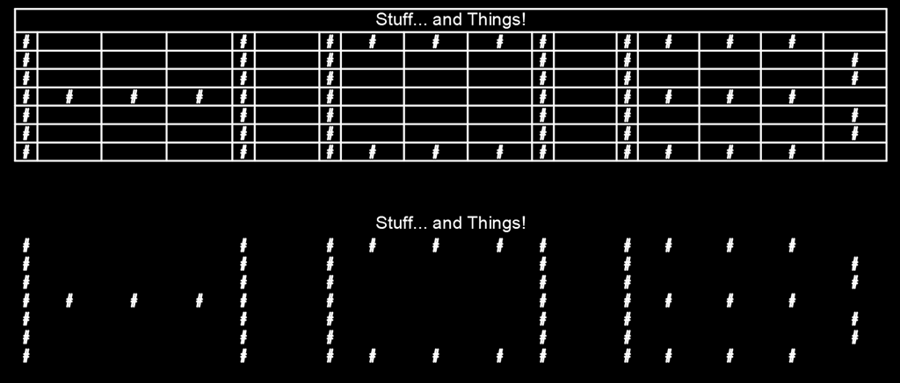
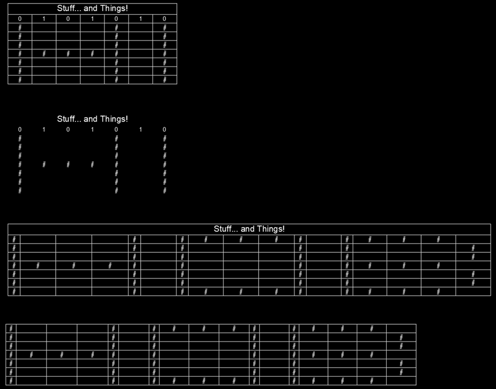

More often that not I am usually trying to get data out of AutoCAD. However, over the years I have made lots of lisp routines that enhance or modify existing tables created by a piping software and in truth I've even lazily used the DATAEXTRACTION command as part of a manual 2D isometric programs BOM. I recently had an objective where I simply wanted to visualize a list of linear items into a very confined area of the title block. I could of prepopulated a table and deployed a modified version of previous work, but I figured it was about time I had the ability to make tables from scratch. In addition to that, I didn't really find the data extraction functionality very capable of automatically moving up data into a new column from a linear list as needed. Between that and a desire to potentially recycle this for use with Object DBX tasks; the choice was clear.

By keeping this simple, it does make it a requirement for you to setup your Table Styles in your templates ahead of time. It is also important to point out that I avoided all possible data type casting and just converted it all to strings using *VL-Princ-To-String*. The reason I chose this has everything to do with making it as bullet proof as possible; aiming for the “it just works” philosophy. In fact, I embarrassingly use that function a lot instead of testing for various data types. The reason, well I just don't think it is possible for it to error as long as it received a single argument and it will always returns a string no matter what data type was in its single argument. Even nil return “nil”…. Yes, I am being lazy, but the purpose of this was to visualize data quickly and hopefully without fail. If you want to visualize all the decimal places of a real number, then just make sure you RTO's your data prior to the handoff.

# Known Limitations
- You may not be able to do formulas on the resulting table
  - This is because all data is being converted into string data
  - AutoCAD is fairly good at auto detecting usable types, but I am forcing it to make those assumptions
- Minimum width of your table must be at least equal to the number of required columns
  - This was handled in the code, but could explain why tables turn out wider than specified
- Auto sized column widths are somewhat primitive
  - Is not measuring the output text
  - Based solely on character counts in each column
- No testing has taken place with Down->Up orientated tables.

# Disclaimer
It is important to note that this function perfectly met the needs of the project I was working on and every attempt was made to create a function that just plain worked as long as you provided correct arguments, but ultimately I have not tested every possible use and situation. So, if it doesn't work in some situation, then let me know and provide all the info/criteria you can and I'll see if I can smash the bug. I do intend on using this many more times in the future and have an interest in further development/bug fixing along the way. You can check back for newer versions if you do run into a problem with the one you have.

# Download
You can [Click Here](/assets/lsp/HOB-SST_v1.0.lsp) to download the code.

# HOB:SST function breakdown
SST means Stupid Simple Tables. Hopefully that is what I accomplished here. Lets look at the arguments.

### Arguments by type
(HOB:SST *String, List, List\<List\>, Point, Number, Bool, Bool* )

### Arguments by name
(HOB:SST *Title, Headers, oData, Corner, Width, AutoSize, ShowBoarders* )

Title - *String*  
If provided any value other than nil, then the table will be created with a title Row and have this value assigned to the cell.

Headers - *List*  
If provided (not nil), this must be a list of some kind. The created table will contain a headers row and the length of this list will determine the total number of columns the created table will contain. Even if your data has a greater number of data values they will simply be omitted from the output.

oData - *List of Lists*  
This is your list of row data lists. A single row of data should be a list of values for each of the columns represented. If you want to skp a column within your data, then you can simply provide that index a value of nil or an empty string. However, keep in mind that when columns are being auto sized, a nil value technically has a character influence of 3 and an empty string is zero. In this function, I chose to utilize nil instead of facing the possibility of potential errors. Which actually made several other aspects easier and lazier too. Finally, if no headers were provided, then the list length of the first row of data will be used to determine the total number of columns the created table will contain.

Corner - *List of X Y Z*  
This will be the insertion point of the created table.

Width - *Number*  
This is the target width of your table. This does not need to be a known value, but you do have to pass it a number data type and you can just give it zero if you want it to be a minimal as possible. Ultimately, your table must be at least equal to the number of your columns. The *vla-addtable* method actually errors if this criteria isn't met. So, I added some logic to safe guard against this and may be the reason your tables aren't coming out at the width you specify.

AutoSize - *Boolean*  
By providing any value other than nil, this function will attempt to adjust the column widths to best display your data. The method in which this is done isn't very sophisticated, but it should generally work pretty good. A simple character count weighting is what will determine the percent of the total width to allocate for a given column.

ShowBorders - *Boolean*  
As I was writing this post, it occurred to me there may be some application for keeping a particular drawing type of a particular projects general notes stored somewhere and using this function to display them dynamically in a table. So, I added the ability to Hide/Show all the borders. There have been several times over the years a table without any visible cell separators has come in handy…

## Example Output
Nothing revolutionary here, but this is a power I've been meaning to add to my tool box for quite a while now. Figured I would share what I came up with. I provided a command in the download lisp called HOBExample. It will have an output something like this after you click 4 points. Hopefully this image visualizes some of the column quantity/data omission limitations and width specification requirements I explained.

