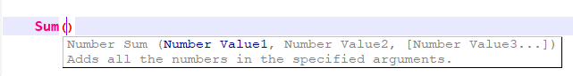
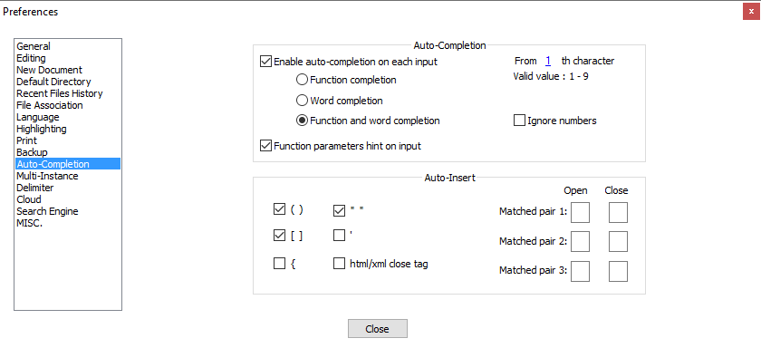

I still have a great lisp management tool coming, but lately I've been writing some very rigid SharePoint validation formulas and couldn't find a good syntax highlighting utility. The closest thing I [found](http://dailydoseofexcel.com/archives/2010/09/29/formula-editor-in-notepad/) was for [Excel](https://support.office.com/en-us/article/excel-functions-alphabetical-b3944572-255d-4efb-bb96-c6d90033e188). Which is extremely similar, but it has 3-4x the number of functions that SharePoint does and I was generally looking for something more complete for my needs. So, I just made my own for Notepad++. I took it *"all the way"* and made the AutoComplete xml for it as well. See below for my recommended N++ settings on AutoComplete.

# All the way
I really did… I read somewhere that Notepad++ could fail to load an autocomplete xml if the entries weren't in alphabetic order. Once that notion was in my head, I lost all interest in “managing” that document as I needed particular functions and decided to just do all of them/get it over with. The result, just about everything except argument (long) descriptions were transposed from [this link](https://support.office.com/en-us/article/examples-of-common-formulas-in-sharepoint-lists-d81f5f21-2b4e-45ce-b170-bf7ebf6988b3) and some other stuff that oddly didn't exist in that official documentation page.

Cool right? Okay, now here's the problem. Unless your working on a large TV, in many situations the function documentation had a LOT of text and it will scroll right off into other monitors/infinity within Notepad++. I've tried just about every version of line feed (&amp;lf; \n  \r) I could think of to make it jump down a line for long strings, but never found a way to make it happen. Hopefully N++ will update their application to do this automatically; what good is excellent on-demand documentation if you can't fully utilize it right?

# Recommended Notepad++ Settings
The settings below seem to be working the best for me, but if anyone has any suggestions on how to keep the different capitalizations of existing content from finding its way into the AutoComplete list, then please share.

# Downloads
Redistribution of these XML's is prohibited by anyone other than the House of BIM and notepad-plus-plus.org.

The UDL needs to be imported through the N++ interface. Just go to Language-&gt;Define your language-&gt;Import-&gt;select this file.

[SharePoint Formulas UDL.xml](/assets/misc/SharePoint%20Formulas%20UDL.xml)  
*Redistribution of this XML is prohibited by anyone other than the House of BIM and notepad-plus-plus.org.*

The AutoComplete needs to be manually placed in the “\Notepad++\autoCompletion\” directory; wherever that may be... For me it is inside of the Program Files (x86) directory.

[SharePoint Formulas.xml](/assets/misc/SharePoint%20Formulas.xml)

# Notes
- The AutoComplete filename has requirements for it to exactly match the name displayed within the “User defined languages” dialog. It is NOT recommended to alter the names of these files or the language within the interface.
- There really isn't a filetype associated with this. So, I just picked one; SPF.
- UDL's seem to lose their font family information on import, I highly reccomend you go set all of the various parts to use Consolas after you've imported it.
