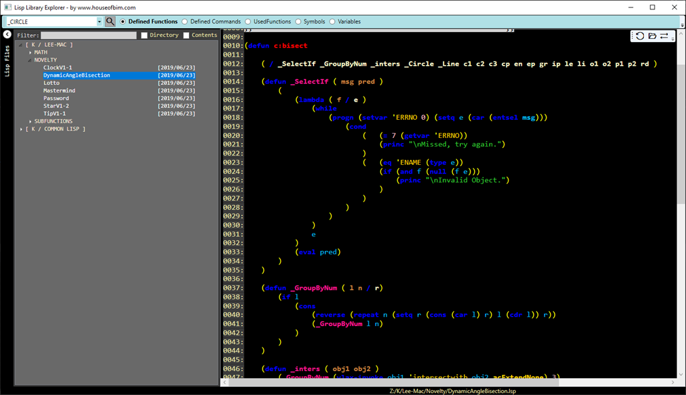
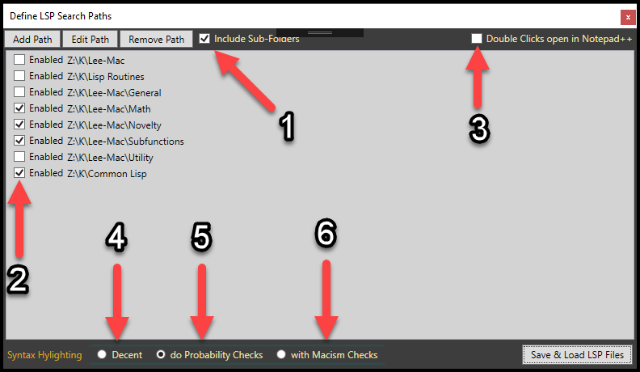
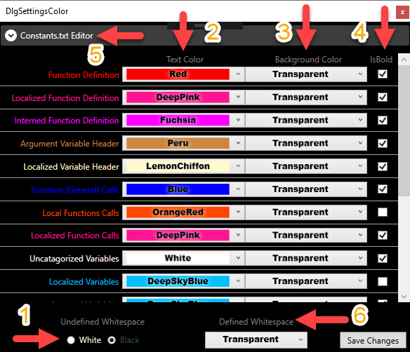
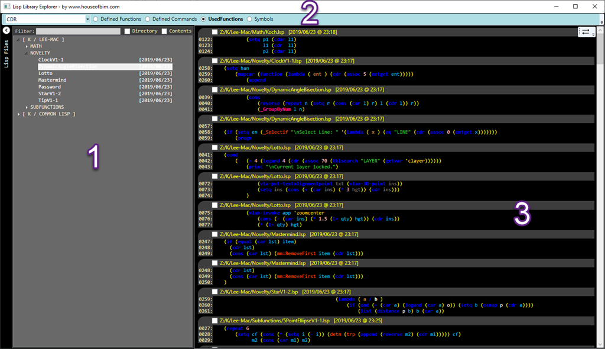
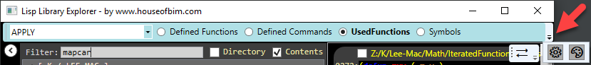
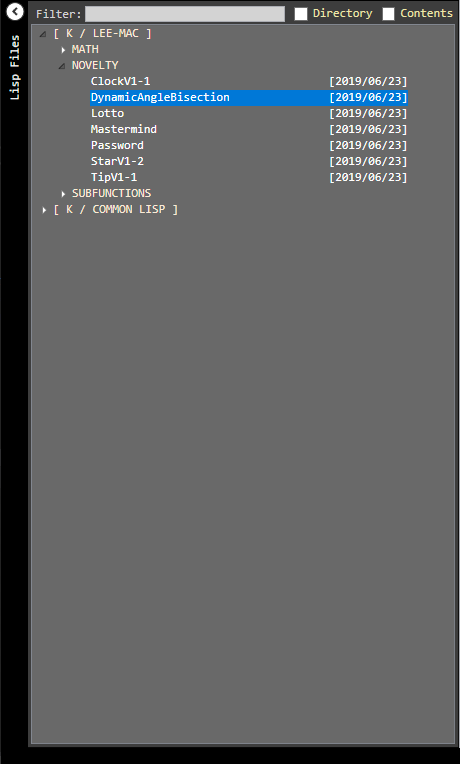
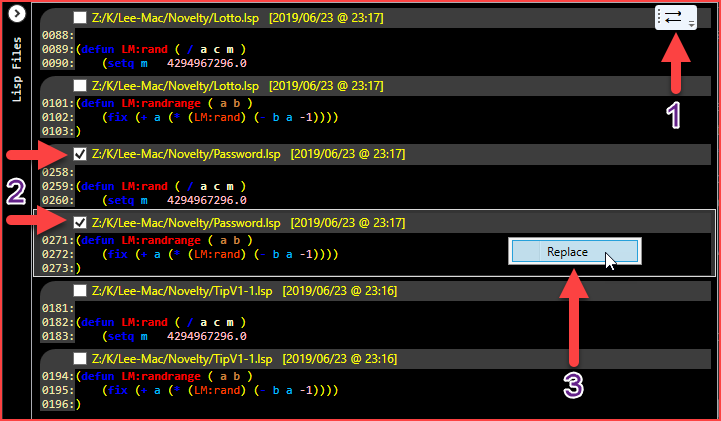
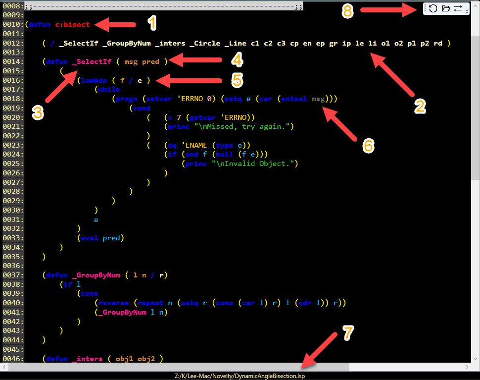
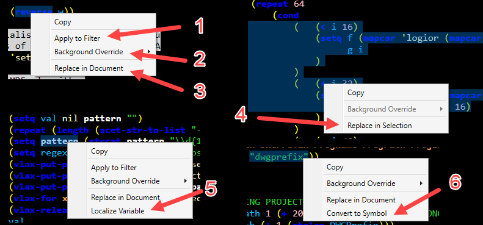
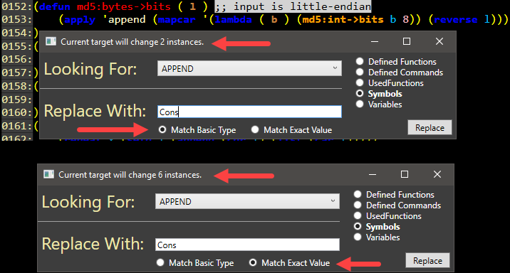

Today I present another long awaited free utility that should help fellow lisper's better utilize their Lisp libraries. For those of us who have have written many thousands of lines and often find it easier to start from scratch than locate something we worked on 2 or 3 years ago; this tool is for you! Although I would honestly recommend this tool to people who are trying to learn as well. I know the ability to quickly pull up a ton of practical usage examples on pretty much any function (depending on your library) would have certainly helped me a ton. So for newbs, I'd suggest you go download every free LSP you can find and just make a giant dumping ground and leverage this app to quickly find examples.

- Increase code recycling by locating existing work and gaining a clear understanding of everything that change would affect.
- Increase efficiency by quickly locating functional examples of any function you've previously used in your library.
- Provide filters that build upon each other to narrow down precise results.
- Provide multi-document search & replace so that your entire library can migrate in new directions.
- Identify dependencies by colorizing global, internalized semi-global and localized Variables.
- Identify dependencies by colorizing root, localized and internalized Defuns.
- Identify defined Command name conflicts and what shortcuts are already in use in your library.

Expecting at least 1 update to this so I am going to stop and put the version/download link here:  
[Download HOB Lisp Explorer v1.0](/assets/dotnet/HOB.LispExplorer.v1.0.zip)

Let me just go ahead and clarify one thing, this is NOT a Lisp editor! This application does its best to colorize the lisp code, but generally speaking it has very little information about the lisp language baked into it. The only functions with special handling are Defun, Lambda, Foreach, Vlax-For, 1- and 1+. Everything else is discovered through code stepping, a bunch of educated guesses and one file that predefines constants. Because of this, there is a possibility that this utility will work reasonably well for Common Lisp, but I have not really looked into it. This program started out as a well developed/clean C# utility, but has honestly got away from me while I was slapping band aids on all the holes/adding impulse features. It does have some pretty good bones though if someone wants to try polishing it better for Common Lisp; just use the contact page and request the code. I am willing to share it, but not offering it up by default because it got a little ugly.

The "Constants.txt" file is completely configurable with whatever values you want to put in it. I just dumped/type checked around 1000 Symbols & Value Constants out of AutoCAD using Atoms-Family to define the default values. However, if your company has global variables you like to populate and use all over your code (like we do) then by all means add your own…

With so little baked in knowledge of what native functions exists, the highlighter is going to have some limitations. It will struggle more with someone like Lee Mac who likes to use functions in quoted lists and redefine functions on the fly in various unorthodox ways. Because of this, I added an extreme backchecking functionality that could be toggled to properly highlight the vast majority of Lee's code. I actually thought I was done with this thing quite a while ago, but then I went and downloaded 5mb of LSP's from his site to sanity check against and found a great deal of holes I needed to patch. Even my extreme backchecking isn't going to handle some of his oddities, but I am at the point that I'd have to bake in a lot more than I intended to obtain more coverage and that wasn't my goal.  Note, if you are not trying to read LM functions, then don't use the *Macisms* feature; it literally takes 5x as long to load your library into memory….

The other two highlighting features honestly have very comparable performance, but I eventually plan on migrating more stuff out of one to make the basic highlighter pop up the library almost immediately.

# The Settings
This dialog will be the first thing you see when the application starts. You must provide it directories containing Lisp files if you want to get anything out of this utility.

The 3 buttons at the top should be pretty self explanatory. Use those to add your various directories containing Lisp files. The other 2 buttons let you manage what is already in there by changing/removing existing items.

1. The Sub-Folders checkbox determines whether the application will follow all the subdirectories within your list of searchable directories.
2. The individual item checkboxes enable you to have ALL your potentially needed directories in the list, but choose which ones your currently working with. This is great if you have a few super archaic archive folders you occasionally need to fish around in or just plain need to look at some backup versions to understand what changed.
3. Opening files with Notepad++ instead of the internal viewer is ALWAYS an option because holding the SHIFT key will do the opposite of whatever this checkbox says. This isn't an editor, so your if your workflows frequently need to go straight to N++, then check this box.
4. This currently is doing all the same work #5 is, but not quantifying the number of instances a particular item was used as a function instead of a variable and thus will occasionally color some functions as variables. This will be reworked in later versions to make the editor load nearly immediately, but there will of course be a price of poorer colorization.
5. This setting was largely created to combat when a quoted parenthesis is dynamically creating a list of variables/data types vs dynamically declaring some kind of function(s) method. This setting currently (v1.0) has very comparable performance to option #4 and is taking less than 20 seconds to load/evaluate 5mb of Lisp data. You should generally use this setting unless your studying someone else's work or hunting for something very specific to go steal real fast.
6. I am a pretty crafty lisp guru, but Lee is really hard to follow sometimes…. My attempts to stress test the colorizing against his stuff only further substantiates that fact. However, this feature does do some seriously irresponsible stuff to try extra hard colorizing just for his insane code manifestoes. It is literally backchecking every single "word" all the way up to identify stuff that may have come into a new context through the currently ascending processing. It will take 5x as much time to load your library and should be avoided more often than not.
7. ***Not shown***, but the 1.0 release build included a checkbox to ignore directory paths containing the word "Archive" per Andy's request.

Upon clicking *Save & Load LSP Files*,  the program finds all the available Lisp files, collects their data, figures out what all the various parts of it represent and builds keyword lists.Which all get used in various ways that we'll cover shortly, but for now lets talk about color.It was the goal of this program to visualize more about the Lisp code than the traditional AutoCAD Visual Lisp IDE would normally help clarify. With that said, you will probably want to go through all the individual tags and read their tool tips. Each of them have a fairly detailed explanation of what their goal was, but if you aren't sure, just ask in the comments and I will try to explain further.

This dialog is a little ugly, but it was necessary so that you can get a good idea of what the highlighting would actually look like. Here is a quick rundown of the numbered items.

1. There are exactly 2 background themes for Code areas. Your options are Black or White, the app comes preconfigured to Black.
2. The primary part of this interface is all the various colorizing categories. Item 2 is the text draw color.
3. This defines the background behind the text draw color. I prefer to avoid these, but it is an option and I considered doing this for defuns out of the box, but ultimately changed my mind.
4. I find the bolding option to be very helpful because of my color blindness and the large degree of color categories. This lets me keep similar items the same color, but emphasize one of them a bit so I can tell the difference without making it entirely psychedelic.
5. This drop down actually gives you editable access to the "Constants.txt" file from within the app. You can add or delete whatever you want from this. Generally speaking it overrides just about all other color rules to classify those specified items as Symbol/Data Types.
6. I don't know why you would want the spaces and tabs colored, but if you do this options for you.

In the next section we will go over the primary interface and I'll show you where to access these settings once the applications running.

# The Primary Interface(s)
In the Image below, the code viewer is not shown. Refer to the first image of this post for approximately what that looks like and we will cover it in a bit of detail (sectioned out) later.

The image shows 3 distinct interface locations and these locations are defined as:

1. File Explorer - This is exactly what you think it is and yes double clicking a file will open it in the internal viewer or Notepad++ depending on whether you checked the box on the first dialog. Holding SHIFT while doing this will do the opposite of whatever you checked. Which basically means you can always open with Notepad++ to do some editing whether you checked the box or not.
  - Also note that with none of the boxes checked, the filter box searches file names, but with the boxes checked  it includes the directory path and all of the LSP contents too. Finally, you can also comma delimit keywords, but make sure you use your most import keyword first.
2. Data Filters - The options available in the combo box drop down vary depending on which of the radio buttons you have checked and which files you've loaded. This program is only presenting you a list of things it found and does not know anything beyond that.
3. Snippets - These are essentially the result of the Data Filters & the File Explorer filters. If you have the *Used Functions* radio checked and APPLY selected in the combo box, then the ONLY files the snippets will show you are ones containing the APPLY function. A snippet itself is actually the line of code containing your Filtered Data Type, the line before it and the line after it; this way you get a small degree of context as the same time. 
   - *Also note, if you were to go into the File Explorer filter, check the Contents box and type a value of MAPCAR, then it would drastically increase your odds of locating an Apply/Mapcar combination you could glean context from.*

# Data Type Filters

Here is a quick rundown of what you can expect to find by using these different radio buttons.

- Defined Functions - These constrain the results to files by the DEFUN statements they contain. This bar while the snips window is open always represents 100% of the files that it found in your library. This can be quite a powerful tool to find duplicate definitions.
- Defined Commands - Exact same situation as the functions, but anything that was defined starting with C: has been isolated to here.
- Used Functions - Used is the correct word because this program has no idea what AutoCAD natively defined. So, this list will be as complete as you're library makes it. It is also important to note that this is a GIANT repository of all functions which includes the ones you've defined. This is a good place to go if you want to find absolutely all possible instances of something. A fine example of this is having a generic Lisp that gets loaded on startup and creates functionality for other Lisps that also load on startup. In the secondary lisp routines, they are not aware of where their "functions" were defined, they only know they exist. If you were to filter only for the Defun's, then it wouldn't return the downstream instances that were utilizing those globalized general purpose functions.
- Symbols are defined as all items in the constants text file and ANYTHING other than a parenthesis prefixed with a single quote. With that said, this list should also be checked if you are doing some kind of mass migration of function names.
- The little sliver on the far right corner is where you would access the settings for this program; shown by red arrow.
- ***Not shown***, but while in the Lisp Viewer (IE, double clicked a file in the explorer or one of the snippets) there will also be another radio for variables.  If I were to load all variables at the "library" level into a single combo box it would probably crash. However, when viewing a single document it becomes perfectly fine to show/filter the variables down to that single document. 
  - Also note that when using the lisp file viewer, all of these radio buttons are filtered to only show values applicable to your currently open document.
  - Additionally, the Lisp Viewer has a search button that is always based on whatever the current applied filter is set to, but the results don't actually care about type matching. So both "HOB" and ‘HOB would be found by the search button.

# File Explorer
At the time of writing this I still have more functionality to add. I will cover some of the information as if it exists now, but most exists now and the rest will probably be in the 1.1 release.

Filter Keywords may contain spaces, but not leading/trailing spaces. You define the end of one keyword/phrase and the start of a new one by separating them with commas.

This area is collapsed by default and the the arrow in the top left above the vertical words "Lisp Files"  is the toggle.

The root folder for located files is something of a 2 directory context key. Everything after that should be either a folder or a file you can double click to expand/open. This area also respects the SHIFT override to do the opposite of whatever double click you are configured to. If you double click a file with keywords applied, then it should open to the first line containing your first keyword; which is why your first keyword is important.

By default the filter textbox only searches the filename. If you click directory it will also search its path. If you click the contents button then it searches the lines of code in each of its Lisp files for documents that contain **ALL** of your keywords. Using these in conjunction doesn't mean that all 3 data points have to contain the keywords, it just means any combination of the 3 must contain all your keywords.

The right click menu will (eventually) provide options for Opening, Renaming, Cutting & Pasting files. I think there is more to be done with the right click, but I am on the fence whether it is functionality I really want to add. Kind of a high level section that I don't want overstepping its bounds.

# Snippets
Double clicking a snippet will open it directly to that snippets line number in your designated viewer/editor. Note that these snippets also respect the SHIFT override and will do the opposite of your configuration if SHIFT is held while double clicking.

1. This is actually a swap function that only appears on the snippets pain once an LSP file has been opened on the internal viewer. This is essentially a toggle between the "currently opened document" and the snippet editor. No reloading happens in this process so fast swapping between them is quite efficient if you want to refer back to something else you saw. Also note that CTRL+W (typically document close) also triggers this button. This same "document'ish" level toolbar obtains additional functionality in the Lisp viewer.
2. The breakdown of a "snippet" is a checkbox containing the fully qualified path to the file and the date/time it was last modified. This checkbox denotes whether something is selected. This checkbox "means" it has been  "marked" for replace operations. This checkbox qualifies only 1 instance. If you are filtered down to the + function and a single line contains multiple instances, then you will see multiple snippets showing identical information, but the first instance in the list represents the first instance in the line and so on. On the far left are the actual line numbers this snippet is representing and to the right of that is the code which should always contain a line indicative of the Data Type Filters.
3. The replace option of the right click menu will only present itself when over a snippet that is in a "selected" (checked) state. When you click Replace, you are in fact running the replace on all "selected" instances of the snippet list; watch those checkboxes! 
   - There isn't currently a select all feature, but that will be added with the 1.1 release. To unselect all, you could simply change the primary combo box filter to a different item and then swap it back or use the toggle from #1 to visit the view and come back.
   - This replace will present an arbitrary value replace input box. An empty string is exactly the same as canceling out of it so this is unsuitable for clearing an item completely out, but that is more of an editing task that I would prefer to be done with an actual editor anyway.
4. ***Not shown***, the release build of this has right click options for "Checking" and "Unchecking" multiple snippets at once

# Lisp File Viewer
Below is approximately what you'll find when looking at the internal Lisp file viewer. This was packed with all kinds of subtle functionality to help you manage your existing lisp routines. One of the hidden features that doesn't have a number is the ability to hold shift and move your most around to highlight the scope of what your hovering over; very similar to double clicking a parenthesis in the VLIDE, but doesn't require you to be over anything that specific.

1. This root level Defun is colored to denote that it isn't owned by another Defun. This being a C: prefixed function name has no direct affect on the coloring scheme.
2. The localization variables for the C:Bisect command were all identified and colored appropriately to indicate their special nature by the *Localized Variable Header* rule.
3. _SelectIf is a Defun that lives within the C: Defun and thus has a child/parent relationship preventing it from having scope until the parent is called. This application calls this prerequisite relationship *interned*, but because the C: Defun actually localized the _SelectIf function, it is really being colored by the *Localized Function Definition* color rule.
4. That same _SelectIf definition had arguments that are passed to it when it is called. These were identified as having special nature and were colored appropriately by the *Argument Variable Header* rule.
5. This Lambda has multiple parent/child relationships, but is colored blue because it is just a function, but not a defined function.Special handling was added to identify the argument/localization of this function and indicates the same way the previously discussed color schemes.
6. The MSG variable is colored quite dark because it was used within the scope of the LAMBDA. So, it is considered to be in an interned state. If it was used outside of the scope of the LAMBDA, then it would not be interned and thus would be a light blue color to represent it was a localized variable.
7. This bottom bar always shows you the full path of whatever file is currently loaded in the viewer.
8. This tool bar has a few things to help you manage the context of whatever workflow your trying to accomplish. From left to right:
  - Reload, this is especially useful if you found stuff you wanted to edit, opened your files with Notepadd++ and now want to update your Lisp Explorer version of that to verify your work.
  - Open, this button ALWAYS opens the viewers current document in Notepad++. This is especially useful because it should open to the exact same view. This makes it so you can use the internal viewer for the best context and N++ as an actual editor in a very clean way.
  - Toggle, if the viewer is the active control, this is also bound to CTRL+W. All this does is toggle between the Snippet & Viewer panes of the Lisp Explorer. It was designed to be a quick way to go back and review the Snippet groups that probably brought you to that document in the first place.
9. ***Not shown***, there are many other color rules in play like string and number identification, quoted symbols, global variables, etcetera. Another such behavior is FOREACH and VLAX-FOR, they were both treated identically to LAMBDA, but are only expected to define a single Argument variable. Because of this, you get parent/child coloring even within nested loops. I find this to be both good and bad depending on what your trying to figure out at the time. I may add a feature to toggle this off at some point.

# Lisp File Viewer - Context Menu
I suspect the next update of this will include more functionality, but the initial release of this does have quite a few features to help you manage the contents of your lisp files; all of which exist in the right click context menu. Note, this context menu has a lot of emphasis on context and because of that you need to make sure your actually right clicking over something it can glean that context from. If you target empty space, it won't show up at all.

1. Apply Filter, this is the easiest way to set your top filter bar to a specific context. You must have a single "something" selected in order for this to work properly. In this example the top bar would be filtered to **Used Functions** and the dropdown set to the **REVERSE** value.
2. This flyout has a lot of colors you can apply to your single selection. If we were to select White from the flyout, all instances of the term REVERSE would be given a white background color; until the viewer reloads anyway. 
   - Note that this does not care about type matching, but wouldn't find anything like REVERSE-BACK because their actual value isn't 1-1. This feature is especially helpful in large Lisp files with lots of interned items where the over colorization of things can sometimes seem like a detriment while trying to unravel what its doing.
3. We'll review the search & replace dialog next, but as this says, the scope is your entire document.
4. We'll review the search & replace dialog next, but as this says, the scope is restricted to your current selection.
5. This is super helpful when your reviewing some new piece of work you made. If you missed localizing a variable, this viewer will highlight that global for you and this right click option will find the closest Defun or Lambda and it to the localization header for you.
6. This was added because string values aren't tracked in any meaningful way by this application and in many circumstances you can use a symbol or string interchangeably in lisp. In this example, I would be converting "DWGPREFIX" into ‘DWGPREFIX and then that would appear in my symbols dropdown filter.

# Lisp File Viewer - Search & Replace
It is best practice to use the **Apply to Filter** functionality prior to selecting either of the **Replace** options; this will save you a lot of time hunting/pecking for the right item in the filter boxes. The example below is using the Replace in Document option, but the replace in selection would be no different except with a narrower scope. That narrowed scope also extends to the available options in the dropdown box, so sometimes it is better to expand your selection a bit to obtain the option you want available.

There isn't a lot to explain here that isn't obvious or relative to things we've already covered, but I drew red arrows on the one unique behavior of this dialog. As you type something in the replace box, the program will automatically start figuring out how many replace operations would be affected. It reports those values in the title bar of the replace dialog. Toggling the bottom radios would update this value and I picked a particularly good example of what makes these different.

In the example above I am looking for a Symbol of value Append. We all know Append is a native function, but the first dialog is using **Match Basic Type** and the second is using **Match Exact Value**. The second doesn't care if it is a Symbol, Variable or Function, but won't have any affect on stings. The first one is similar, but has 3 very broad categories it will consider equal only to a value of identical category; these are Function, Variable & Symbol. This is why the second dialog would replace many more instances of append than the first dialog.

# Why I needed this
The creation of this is for many reasons, but the extreme probability of oversite when doing major migrations of whole libraries to new philosophical arrangements is the real reason this was created. I've done this many times over the years as my understand and desires evolve, but that task gets more daunting every single time because the library just gets bigger every year. I needed a way to accomplish very ambitious goals without troubleshooting oversites for months and nothing existed to help make that happen. If you find yourself in that situation, use this and it should help avoid many of the oversites that come with major rearrangements of interconnected Lisp.

This is an analytical tool with some editing capabilities, not an editor. With that said, I am very interested in adding on more analytical parts to this, but can't think of any more that would be worth the effort. If you have any ideas for additional data points this could produce and would help solve some difficult to understand relationship, then let me know. Right now, my only analytical idea for the 1.1 release is adding a right click **GoTo** definition so I can jump to a (defined) used function and because of the divided nature of my library, I will probably include an option to do a full library search. Got some others ideas? Please share…
