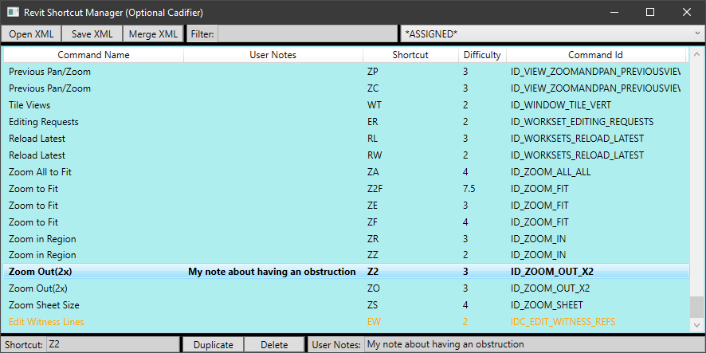

This is something of a sensitive topic. A pure-Revit guy would consider this blasphemy, but for an AutoCAD user, what I have done could be a real blessing. From my perspective, if you have skills, then you should be able to use them and the design software should be a nearly irrelevant factor on whether or not you can competently coordinate a project. I fundamentally believe people should be enabled to work whatever way they can be the most productive and accurate. These philosophical principals are quite hard to pair with Revit, mostly because it is such a large deviation from the way many design software's interact with their users.

For us, we have been “waiting” for Revit to give us everything we need to do our jobs for many years and because of our desired dependency on generating 2D isometric fabrication drawings, I keep coming up with the same answer of: “its not ready yet”; which is still true… However, they have been progressively bridging the gap and they are most of the way there thanks to the integration of the Fabrication Database. The API is again very different from what I am used to, but fairly well equipped to let me fill in a few of the (major) outstanding gaps. For example, you could remake the SL1 command in less than 20 lines of code. The point I am making, is that we literally can't get rid of AutoCAD until Revit gives us the ability to properly edit DWG content or the Plant3D PCF->DWG generator can create an editable Revit sheet instead of a DWG. Which means, we have no choice but to use 2 wildly different software packages to go from Design and Coordination all the way to Fabrication. If we can't align those to some degree, then we would be dooming our staff to a perpetual warm up cycle trying to switch between them and that is ultimately the problem I needed to solve.

## Revit Shortcuts
I am a long time AutoCAD (ab)user and you might think that I can't live without the command line, but that just isn't the case. To me a software is just a tool and we are the skilled labor. When trying to create a custom Revit shortcut configuration, you will very quickly run into what I call the “Traffic Jam” scenario. For Example, if you wanted to use “C” for copy and “CC” for Create Similar, what you wind up with is inconsistent behavior. When using the “C” command, you'll have to hit Spacebar or Enter to execute it. However, the “CC” command will fire immediately. Being an avid keyboard user, I find that quite intolerable, confusing and honestly I'd rather die than play a perpetual game of where's waldo with Revit's labyrinth of an interface. Eventually I figured out that absolutely everything could be mapped to explicitly have that next obstruction and that forces Revit to consistently require a Space or Enter smash for the “go do stuff” initiation. This was pretty much life altering because I was no longer playing an extreme game of chess using super odd character combinations to avoid these conflicts. I was no longer making commands that start with “S” a minimum of 3 characters to avoid these conflicts. I could easily map all the AutoCAD comparable commands to Revit commands…. If you've played this game, then you get the point…

My solution to this is a complete redo of the Revit Keyboard Shortcuts (KS Command) editor.  

[Download Link](/assets/dotnet/RevitCadifier.exe)

When you export the current shortcuts, they produce a very basic XML file. This file gives you access to 100% of the content available in the KS editor and even various things that this dialog is somewhat hiding from the user; most notably the CommandID. While trying to setup our shortcuts, I ran into a lot of redundant situations where the CommandID was actually the best piece of information. So, my implementation actually shows you that ID string. Mine also has a more complete map of what that KS dialog calls the Filter. The weird thing about Revit, a command can be contextually available in MANY places and that Filter string essentially tells you where it is located in the interface. Which is still somewhat useless for the purely contextual items, but again, that CommandID goes a long ways towards finding the one your looking for.

Here are a few more of the problems my shortcut editor solves or at least helps mitigate:

## Command Research
For me, unraveling what each of Revit's 1700+ commands actually do was quite a lengthy task. Which ultimately led me to maintain a spreadsheet of my own “definition” for what each of them did. This is because they often didn't describe themselves very well based on the Name field. Once I figured out all the ones I cared about, the process of making a master shortcut file became pretty painful because of this lack of clarity. Which is why, this application injects the “User Notes” XML property on whatever it saves. This is just an arbitrary field for you to leave yourself notes, but I would probably recommend also using some kind of a custom (sortable) prefix to add a level of grouping to your planning exercise.

***Note:*** this data field is entirely ignored when Revit imports your XML. Also important to note that an export does not later produce your previously saved data. Which is why the MERGE button exists in my interface. This lets you open your original definition that you did all the work in, but still import anything from a new Revit version XML export. If you've assigned your “User Notes” field some kind of data, then it will be very obvious what came in with that new export.

## Duplicate Shortcuts of a CommandID
When you are trying to create a master shortcut file (especially for a pure-Revit user), you typically want to sort your shortcuts to check for obstructions. Well, the Revit dialog will let you do that, but it will group all shortcuts to the same CommandID together and prevent you from actually seeing a complete ascending list of all your shortcuts, which makes it harder to check for (traffic jams) obstructions. In my implementation, I made all of those separate line items to prevent this problem. You accomplish multiple shortcuts by using the “Duplicate” button at the bottom of the interface. This essentially copies your selected shortcut, giving you another place to define shortcuts. You can see multiple duplications in the above picture. 

***Note:*** the delete button will delete a duplicate, but it will never eradicate a CommandID from your list. However, it will clear its shortcut and any user data you've applied when it is the only instance of that CommandID.

## Key Combo Difficulty Factor
Quite some time ago, I came up with an idea of having a Shortcut productivity rating system, but until now I didn't really have an interface to put it in. This is somewhat subjective, but that's okay because it is mostly there to sanity check your plan. 

Here are some basic principals of how the rating system works:
- Left Home Row keys are free
- The first key off the home row costs 1. This includes T, G & V
- The slightly precarious or still reasonably close keys cost 2. This includes Q, Z, B, H, Y, 1 through 3, F1 through F5 and all the modifiers like Ctrl, Shift & Alt.
- Everything else has a cost of 3

Now, all of that is the base layer, but after those are calculated, then you have more adaptive factors for:
- Number of key strokes
- Cost mitigation for 2 keys of the same value
- Cost negation if the same key is pressed twice
- Minor cost mitigation if you start from a lower key and head to a higher valued key
- Penalties if you go from a higher key to a lower valued key
- Shortcuts with Modifier (Ctrl, Shift & Alt) keys do not receive any adaptive mitigations.

Its not perfect, but a bit of work went into making them meaningful… Because of that, you should probably be aiming for a 2 or less for all of your regularly used commands and you should replace a shortcut with a value greater than 4.5. Which I can tell you the Revit default shortcuts do not remotely comply with that statement.## Visual Indicators

There are 2 types of visual warnings this dialog will give you. The first one is **bolded** text, this is how you can identify commands that will force the use of a Enter or Spacebar input because some other command has the exact same prefix.  

***Note:*** this does not apply to the cadified commands this program “can” make, those are all filtered out in this dialog.

The other indicator you will see is Orange text. This lets you know that 2 different CommandID's have been assigned the exact same keyboard shortcut. Since Revit is highly contextual, this may not be a genuine problem. However, it will help you go investigate the potential of those problems.

***Note:*** I also highly recommend mapping ALL the Cancels to a single shortcut, ALL the Finish Edits to a single shortcut and all the Edits to a single shortcut. Each of these commands are entirely context based and there is absolutely no reason to have well over a 100 different keyboard shortcuts to start editing, finish editing or just escape out of editing. One of the biggest shocks to AutoCAD users playing with Revit is that the Escape key will frequently not get you out of some random mode you accidently entered… 

## Shortcut Assignment
I'll admit this little box in the left corner is slightly irregular to use, but it was either this or make you arbitrarily type Ctrl+Shift+L all by yourself. Here are some tips for using it; which assumes you've put you've clicked it…
- Both Enter & Escape keys actually clear the shortcut definition.
- You shouldn't hold the Control key and then hit B. You will just press/release Control and then press/release B. IE, just treat modifier keys like another character in the alphabet.
- In all non-modifier Key scenarios, you should be able to just start typing the characters you want to assign.

## Save XML Button (Cadifier Feature)
This is where the magic happens that makes Revit feel a bit more like AutoCAD. It does this by allowing you to assign whatever you want and get a consistent interaction. When you press the Save button, you will be prompted with a Yes/No question for whether or not it should save in a Cadified format.

If you click No, you'll wind up with a file that (when imported) would operate just like a pure-Revit user would expect. If you select Yes, then every single CommandID Shortcut you've defined will have your definition and another one with our ¥ tacked onto the end of it. Its honestly stupid how often we can use this symbol to solve problems…. lol….

The cadified end results basically creates consistent and virtually impossible (traffic jams) obstructions, which then forces Revit to require an Enter or Spacebar key for all command execution. Which definitively provided me a warm and fuzzy feeling while working in Revit.

## Other Stuff
- There are substantially more defined interface paths for filtering in the combo box on the top right than you will find in the Revit implementation. This can be valuable tool for locating a button you've been picking that you now want to assign a shortcut to.
- The filter textbox just right of the merge button is for arbitrary input, it searches every data point (including the ones I added) to determine what should be left in the list. This of course works in conjunction with the interface path combo box on the far right.
- You can review all the places any CommandID appears in the interface by simply holding your mouse over a Listbox item and letting the tooltip pop up. Note that there are a few CommandID's exported from Revit that contain no interface location information.
- All columns are sortable
- I would suggest this utility for pure-Revit guys or even for managing your own personal shortcuts against what you were provided at a new company. Fill out that user data field for all of yours and then it will be obvious (using the merge button) what came in from a new version Revit shortcuts export or something you were provided by a new employer.
- If you define something that Revit is protecting (dynamically assigning), then the interface should complain and filter it out during your import using the KS dialog.
- In all situations, once you start using this and you've done work (adding user data and/or shortcuts) you'll want to forever be merging new/other XMLs into your “maintained” xml. This way you aren't overwriting your work. Note, this is because a merge operation will import NO data from a CommandID & Shortcut that already match one currently in memory.
- What this won't do is tell you about all the embedded shortcuts that Revit dynamically applies and mandates for things such as Ctrl+O for open. I've thought about assigning them to my XML so they were at least aligned, but I haven't got around to do thing yet.

Well, enjoy this utility. I know its helped me out a lot…